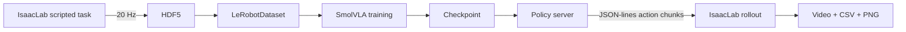

# S4 SmolVLA IsaacLab

基于 **IsaacLab + LeRobot + SmolVLA** 的人形机器人双臂视觉语言动作（VLA）教程工程。
项目覆盖从仿真任务搭建、专家轨迹采集、LeRobotDataset 转换、SmolVLA 训练，到
IsaacLab 闭环 rollout 和动作诊断的完整链路。

当前主任务 `drawer_insert_close`：左手拉开抽屉，右手抓取罐子并放入抽屉，
随后右手退避、左手关闭抽屉，双臂回到结束姿态。

> 本仓库是可复现的项目代码，不包含 Isaac Sim、IsaacLab、单独分发的场景资产包、
> LeRobot 源码、SmolVLM2 基础权重或训练数据。使用前需按
> [安装文档](docs/INSTALLATION.md)准备这些外部资源。

## 项目状态

历史 `v0`（20 段语言）链路曾在固定 seed、关闭随机化的场景中完成端到端验证：

| 项目 | 已验证配置 |
|---|---|
| 任务 | `drawer_insert_close` |
| 数据集 | 200 episodes / 92,036 frames |
| 观测与动作 | 26D state / 26D absolute joint target |
| 视觉输入 | 胸前、左腕、右腕三路 RGB，680x480 |
| 数据与策略频率 | 20 Hz |
| 物理控制频率 | 120 Hz |
| 模型 | SmolVLA，action chunk 50 |
| 已验证 checkpoint | `360000/pretrained_model` |
| rollout 基线 | `complete=True`、`success=True`、drawer `0.001 m`、can z `1.023 m` |

当前活动配置已升级为 `drawer_10phase_v1`，对应新数据集
`s4_drawer_insert_close_v1_10phase`，需要重新转换、fresh training 和 Rollout 验证。
上述历史 checkpoint 不兼容新语言契约；单次固定场景成功也不代表随机场景统计成功率。

## 主要能力

- 可注册、可切换的任务系统，场景和任务控制逻辑保留在 `tasks/`。
- IsaacLab 中的双臂 TCP IK、null-space posture bias 和 6D 灵巧手控制映射。
- 胸前与双腕三路 RGB 同步采集。
- 带失败丢弃、超时重试和成功判定的 HDF5 专家数据采集。
- HDF5 到 LeRobotDataset 的本地转换与契约检查。
- 使用外部 LeRobot checkout 训练 SmolVLA，不修改 LeRobot 源码。
- 通过 JSON-lines 子进程协议隔离 IsaacLab 与 SmolVLA 两个 Python 环境。
- action chunk 重叠融合、20 Hz 插值、phase blend 和 rollout 诊断。
- 独立 Meta Quest 3 WebXR 双手柄摇操，支持双臂 clutch 和连续灵巧手开合。
- 视频、raw/fused/commanded/actual action CSV 及诊断图输出。
- 新任务模板、自动检查和完整工程知识库。

## 系统架构



项目使用两个隔离环境：

- `env_isaaclab`：Python 3.11，运行 Isaac Sim、IsaacLab、场景、采集和 rollout。
- `smolvla`：Python 3.12，运行 LeRobotDataset 转换、训练、离线预览和策略服务。

`run.sh` 会根据子命令选择正确环境，通常不需要手动 `conda activate`。详细边界见
[环境说明](docs/ENVIRONMENTS.md)和[系统架构](docs/ARCHITECTURE.md)。

## 快速开始

### 1. 准备配置

```bash
git clone <project-url>
cd s4_smolvla_isaaclab

cp .env.example .env
# 编辑 .env，填写 IsaacLab、LeRobot 和模型路径
```

将单独分发的场景资产包解压到 `local_assets/isaac/5.1/`。如果本机已有完整
Isaac 5.1 资产库，也可以执行 `bash run.sh prepare-assets --verify`，自动归纳本项目
实际引用的 USD 依赖。`local_assets/` 已被 Git 忽略，详见
[外部资产](docs/EXTERNAL_ASSETS.md)。

至少需要配置：

```dotenv
S4_PROJECT_ROOT=/path/to/s4_smolvla_isaaclab
ISAACLAB_ROOT=/path/to/IsaacLab
ISAAC_ASSET_ROOT=/path/to/Assets/Isaac/5.1
S4_SCENE_ASSET_ROOT=/path/to/s4_smolvla_isaaclab/local_assets/isaac/5.1
LEROBOT_ROOT=/path/to/lerobot
SMOLVLA_MODEL_ROOT=/path/to/models
```

### 2. 检查环境

```bash
bash run.sh doctor --strict
bash run.sh list-tasks
bash run.sh activate-task drawer_insert_close
```

`doctor --strict` 应确认双环境 imports、外部资产、26D schema、三路相机、数据集和
checkpoint 契约。首次安装请先阅读[安装文档](docs/INSTALLATION.md)。

### 3. 启动场景

```bash
bash run.sh sim
```

启动后应检查机器人、两个抽屉、罐子、三路相机和初始关节状态。建议正式采集前先
执行一轮有界面采集，再执行 headless 采集。

### 4. 使用 Meta Quest 3 摇操双臂

```bash
# 首次使用，IP 替换为 PC 的局域网地址
bash run.sh teleop-cert --ip 192.168.1.116

# 启动 IsaacLab 和 controller-only WebXR 服务
bash run.sh teleop
```

在 Quest Browser 打开终端显示的 HTTPS URL。左右 Grip 独立控制双臂 clutch，左右
Trigger 连续控制对应灵巧手。该入口不传输视频，也不改变已有采集、训练和 rollout
命令。详见[Meta Quest 3 双臂摇操](docs/TELEOPERATION.md)。

## 标准工作流

### 采集专家数据

```bash
# 可视化检查一轮
bash run.sh record --episodes 1

# 无界面正式采集
bash run.sh record --episodes 200 --headless
```

只有通过任务成功判定的 episode 才会写入最终数据；超时或失败 episode 会丢弃并重试。
采集细节见[数据采集](docs/DATA_COLLECTION.md)。

### 转换并验证数据集

```bash
bash run.sh convert --overwrite
bash run.sh dataset-check
```

同时验证现有 checkpoint：

```bash
bash run.sh dataset-check \
  --checkpoint outputs/train/smolvla_drawer_insert_close_v1_10phase/checkpoints/<step>/pretrained_model
```

检查内容包括 state/action shape、NaN/Inf、FPS、时间戳、三路视频解码以及
checkpoint feature compatibility。参见[转换](docs/DATASET_CONVERSION.md)和
[数据集验证](docs/DATASET_VALIDATION.md)。

### 训练 SmolVLA

```bash
bash run.sh train
```

从最近 checkpoint 继续：

```bash
bash run.sh train --resume
```

训练参数的唯一配置入口是
[`configs/tasks/drawer_insert_close.smolvla.yaml`](configs/tasks/drawer_insert_close.smolvla.yaml)。
不要只根据 training loss 判断策略质量；还应结合 offline preview 和闭环 rollout。

### 离线预览

```bash
bash run.sh preview \
  --checkpoint outputs/train/smolvla_drawer_insert_close_v1_10phase/checkpoints/<step>/pretrained_model \
  --num-frames 20 \
  --device cuda
```

离线 MAE 用于检查数据与模型接口，不等价于闭环任务成功率。

### 在线 rollout

固定场景回归（关闭随机化）：

```bash
bash run.sh rollout \
  --headless \
  --deterministic \
  --checkpoint outputs/train/smolvla_drawer_insert_close_v1_10phase/checkpoints/<step>/pretrained_model \
  --policy-device cuda
```

随机化成功率（默认范围来自任务 `scripted.yaml`）：

```bash
bash run.sh rollout \
  --headless \
  --success-rate 20 \
  --checkpoint outputs/train/smolvla_drawer_insert_close_v1_10phase/checkpoints/<step>/pretrained_model \
  --policy-device cuda
```

每次运行写入 `outputs/eval/rollout_<时间>_<det|randN>_ckpt<step>/` 一个子文件夹
（多轮随机的 `ep001...` 视频/CSV/PNG 和 `summary.json` 都在同一目录）。
可用 `--output-dir` 自定义目录名。进一步分析：

```bash
bash run.sh diagnose outputs/eval/<run_dir>/ep001_actions.csv
```

诊断链路区分 `raw_action`、`fused_action`、`commanded_action` 和
`actual_joint_pos`，用于定位策略跳变、融合效果或底层跟踪误差。详见
[在线 rollout](docs/ONLINE_ROLLOUT.md)。

## 核心数据契约

Schema：`s4_bimanual_v1`

```text
observation.state / action =
  left_arm_7 + left_hand_6 + right_arm_7 + right_hand_6
```

- 实际任务维度为 26D；SmolVLA 的 50D state 和 32D action 是 padding 上限。
- action 是 absolute joint target，不是 delta action。
- 三路 feature key 固定为：
  - `observation.images.chest_front_rgb`
  - `observation.images.left_wrist_rgb`
  - `observation.images.right_wrist_rgb`
- 20 Hz 数据通过每个 action 保持 6 个物理步接入 120 Hz 控制循环。

修改 joint 顺序、维度、action 语义、相机 key、FPS 或 hand mapping 会破坏已有
dataset/checkpoint 兼容性。完整定义见[数据契约](docs/DATA_SCHEMA.md)和
[核心契约知识库](docs/knowledge_base/CORE_CONTRACTS.md)。

## 项目结构

```text
s4_smolvla_isaaclab/
├── run.sh                  # 统一 CLI 和双环境路由
├── configs/                # active task、外部资源和任务配置
├── tasks/                  # TaskSpec、scene builder、controller、任务模板
├── s4_robot/               # 机器人配置、IK、动作与灵巧手映射
├── s4_pipeline/            # 路径、active task 和配置解析
├── data/                   # HDF5 schema/writer 和 LeRobot 转换
├── scripts/                # 采集、训练、评估、rollout 和诊断入口
├── teleoperation/          # Quest WebXR、协议、clutch 映射和独立 runtime
├── environment/            # 双 Conda 环境和版本采集
├── tests/                  # 配置、契约、schema、协议和视频测试
├── docs/                   # 使用文档与工程知识库
├── assets/                 # 项目拥有的机器人和场景资产
├── local_assets/           # 单独分发的场景资产包，不进入 Git
├── datasets/               # 本地生成，不进入 Git
├── models/                 # 外部基础模型，不进入 Git
└── outputs/                # checkpoint、视频和诊断，不进入 Git
```

## 创建新任务

新任务原则上只新增或配置：

1. `TaskSpec` 和 registry 条目。
2. `configs/tasks/<task>.dataset.json`。
3. `configs/tasks/<task>.scripted.yaml`。
4. `configs/tasks/<task>.smolvla.yaml`。
5. `tasks/<task>_scene.py` 和 `tasks/<task>_controller.py`。
6. randomization、success criteria 和必要测试。

转换、训练和 policy server 应继续复用公共实现。完整步骤见
[新任务教程](docs/NEW_TASK_TUTORIAL.md)和
[新任务检查清单](docs/knowledge_base/NEW_TASK_CHECKLIST.md)。

## 常用命令

```bash
bash run.sh --help
bash run.sh doctor --strict
bash run.sh list-tasks
bash run.sh sim
bash run.sh record --episodes 10 --headless
bash run.sh convert --overwrite
bash run.sh dataset-check
bash run.sh train
bash run.sh preview
bash run.sh rollout --deterministic
bash run.sh rollout --success-rate 20
bash run.sh clean --dry-run
```

`clean` 默认只预览将处理的文件。删除数据、模型或输出前必须检查 dry-run 结果。

## 开发验证

```bash
python3 -m compileall -q s4_pipeline s4_robot tasks data scripts tests
bash -n run.sh scripts/*.sh environment/*.sh
PYTEST_DISABLE_PLUGIN_AUTOLOAD=1 \
  conda run -n env_isaaclab python -m pytest -q tests
bash run.sh doctor --strict
git diff --check
```

确认外部 LeRobot 未被修改：

```bash
bash -c 'set -a; source .env; git -C "${LEROBOT_ROOT}" status --short'
```

## 文档

- [文档总索引](docs/README.md)
- [五分钟快速开始](docs/QUICKSTART.md)
- [安装与外部依赖](docs/INSTALLATION.md)
- [配置说明](docs/CONFIGURATION.md)
- [训练](docs/TRAINING.md)
- [在线 rollout](docs/ONLINE_ROLLOUT.md)
- [rollout 诊断](docs/ROLLOUT_DIAGNOSTICS.md)
- [故障排查](docs/TROUBLESHOOTING.md)
- [工程知识库](docs/knowledge_base/README.md)
- [后续 AI 协作指南](docs/knowledge_base/AI_COLLABORATION_GUIDE.md)

## 使用边界

- 项目不会修改外部 `lerobot/` 或 `IsaacLab/` 源码。
- 不要提交 `datasets/`、`models/`、`outputs/`、日志和本机 `.env`。
- 不要用 stiffness/damping 调整掩盖 action 接口、时序或归一化错误。
- 不要仅凭 training loss 或单帧 offline MAE 宣称任务成功。
- 修改核心数据契约前，先确认是否需要重新采集、转换和训练。

这是研究与教学工程，不是经过安全认证的真实机器人控制系统。
