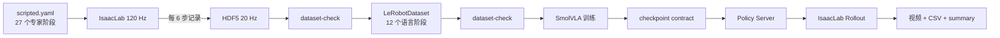
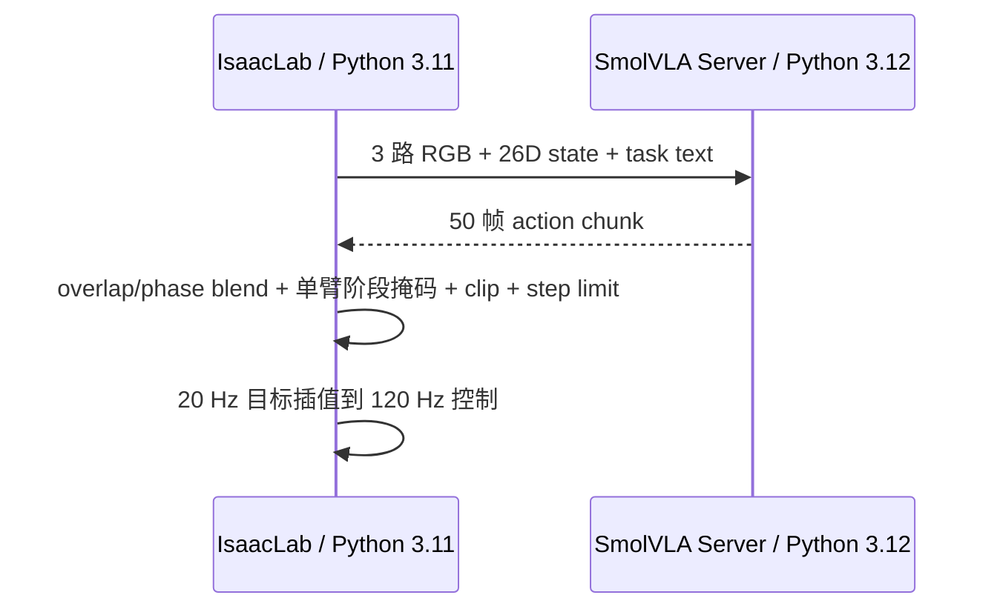

# 完整流水线、契约与诊断

本文档是当前 `drawer_insert_close` 任务的实验手册，覆盖专家采集、HDF5 检查、LeRobotDataset 转换、训练、checkpoint 检查和在线 Rollout。安装和资源部署见 [复现与部署](REPRODUCTION.md)。

## 1. 端到端关系



每一层只在上一层检查通过后继续。失败尝试不能进入成功数据；数据集与 checkpoint 不匹配时不能 Rollout。

## 2. 当前核心契约

| 项目 | 当前值 |
|---|---|
| Task | `drawer_insert_close` |
| Schema | `s4_bimanual_v1` |
| Language contract | `drawer_12phase_v4_serial_acquire` |
| State | 26D actual joint state |
| Action | 26D absolute joint target |
| 顺序 | 左臂 7、左手 6、右臂 7、右手 6 |
| 相机 | `chest_front_rgb`、`left_wrist_rgb`、`right_wrist_rgb` |
| 图像 | RGB，480×680 |
| 控制 / 数据频率 | 120 / 20 Hz |
| 专家 / 语言阶段 | 27 / 12 |
| Action Chunk | 50 帧 |
| 训练 padding 上限 | state 50D、action 32D |
| 主罐随机 | 5×5 分层网格内连续随机 |
| 抽屉初始开度 | 固定 `0.00 m` |
| 干扰物 | 当前默认关闭 |

三个配置分别负责：

- `drawer_insert_close.dataset.json`：schema、相机、频率、数据和输出路径；
- `drawer_insert_close.scripted.yaml`：专家阶段、语言映射、随机化、门控与成功条件；
- `drawer_insert_close.smolvla.yaml`：训练和模型参数。

### 2.1 26D 顺序

```text
[0:7]    left_arm_7
[7:13]   left_hand_6
[13:20]  right_arm_7
[20:26]  right_hand_6
```

灵巧手的 6D 是策略控制维度，不是 URDF 中所有 mimic joint 的数量。改变顺序、符号或 mimic 映射会使旧数据和 checkpoint 失效。

### 2.2 语言阶段

当前 12 个任务文本按顺序是：

1. `Open both hands and prepare for the task.`
2. `Move the open left hand to the pre-grasp pose near the drawer handle.`
3. `Approach the drawer handle and close the left hand around it securely.`
4. `Pull the drawer fully open with the left hand and hold it steady.`
5. `Move the open right hand to the pre-grasp pose near the can.`
6. `Approach the can and close the right hand around it securely.`
7. `Lift the grasped can clear of the support surface.`
8. `Move the grasped can into the open drawer.`
9. `Release the can and move the open right hand clear of the drawer.`
10. `Return the right arm home while keeping the drawer open.`
11. `Close the drawer with the left hand.`
12. `Release the drawer handle, move clear, and return the left arm home.`

27 个专家阶段通过稳定 ID 映射到这 12 个语言宏阶段。左手先到把手上方点，然后从该点开始
闭合四指，同时沿 `base_link -X` 后移 3 cm、下降 2 cm并增加腕部下倾；这些细分动作仍属于
同一个语言宏阶段。右臂先回 Home，左臂再关闭抽屉。转换后的 task 顺序不是依赖 metadata
的首次出现顺序，而是由当前语言契约校验和重建。

## 3. 采集前检查

```bash
cd /path/to/smolVLA/s4_smolvla_isaaclab
bash run.sh doctor
bash run.sh activate-task drawer_insert_close
```

先运行有界面场景：

```bash
bash run.sh sim
```

确认：

- 没有红色错误材质和缺失贴图；
- 机器人、两个柜体、主罐位置正确；
- 抽屉完全关闭；
- 三路相机方向和曝光正常；
- 手指初态没有与物体或桌面穿插。

再做 5 条有界面冒烟采集：

```bash
bash run.sh record \
  --output datasets/staging/s4_drawer_insert_close_v4_12phase_serial_acquire/smoke_5_seed42.hdf5 \
  --episodes 5 \
  --random-seed 42 \
  --episode-timeout-s 300 \
  --reset-settle-s 2.0 \
  --record-every-n 6 \
  --max-failed-attempts 5
```

重点观察拉把手、抓罐、松手后退出抽屉、关抽屉后左手离开把手的物理过程。

## 4. 正式采集

先定义本轮唯一输出路径：

```bash
cd /path/to/smolVLA/s4_smolvla_isaaclab

EPISODES=200
MAX_FAILURES=20
DATASET_NAME=s4_drawer_insert_close_v4_12phase_serial_acquire
RUN_DIR="datasets/staging/${DATASET_NAME}/production_200_seed42"
HDF5_FILE="${RUN_DIR}/drawer_insert_close_scripted.hdf5"
FAILURE_LOG="${RUN_DIR}/drawer_insert_close_scripted_failures.jsonl"
FAILURE_SUMMARY="${RUN_DIR}/drawer_insert_close_scripted_failure_summary.json"
LEROBOT_DIR="datasets/lerobot_data/${DATASET_NAME}"

mkdir -p "${RUN_DIR}"
```

无界面正式采集：

```bash
bash run.sh record \
  --output "${HDF5_FILE}" \
  --episodes "${EPISODES}" \
  --random-seed 42 \
  --episode-timeout-s 300 \
  --reset-settle-s 2.0 \
  --record-every-n 6 \
  --failure-log "${FAILURE_LOG}" \
  --failure-summary "${FAILURE_SUMMARY}" \
  --max-failed-attempts "${MAX_FAILURES}" \
  --headless
```

语义：

- `--episodes 200` 是最终成功 episode 总数；
- 失败或超时 episode 不提交到 HDF5 成功组；
- 失败原因、阶段和物体位置写入独立日志；
- `--max-failed-attempts N` 只限制全局累计失败数，不改变点位重试策略；允许 N 次失败，
  第 N+1 次失败才中断；
- 抓罐相关失败在同一精确位置额外重试 3 次，耗尽后在当前网格单元内重新采样；
  非抓取阶段失败直接在当前格内重新采样，只有接受成功 episode 才推进网格；
- 偶发物理失败需要持续采集时，`collect-convert` 可使用 `--continue-on-failure`。它只取消累计失败次数上限；失败 episode 仍被丢弃并记录，程序异常、契约检查失败和最终成功数不足仍会终止流水线；
- Headless 只隐藏窗口，相机仍然渲染；
- 最终数据只接受主罐根坐标位于配置的宽松抽屉世界坐标 X/Y/Z 区域内的 episode；最终抽屉开度仅记录为遥测，不参与成功判定。

### 4.1 中断恢复

```bash
bash run.sh record \
  --output "${HDF5_FILE}" \
  --episodes "${EPISODES}" \
  --random-seed 42 \
  --episode-timeout-s 300 \
  --reset-settle-s 2.0 \
  --record-every-n 6 \
  --failure-log "${FAILURE_LOG}" \
  --failure-summary "${FAILURE_SUMMARY}" \
  --max-failed-attempts "${MAX_FAILURES}" \
  --resume \
  --headless
```

若已有 108 条成功数据，`--episodes 200 --resume` 会继续到总计 200 条，不是再增加 200 条。Resume 会检查采集契约，并清理由异常中断留下的 `_pending_demo_*`。

不要在 Resume 前改变语言映射、相机、FPS、state/action、随机区域或抽屉初态。

## 5. 检查 HDF5

```bash
bash run.sh dataset-check \
  "${HDF5_FILE}" \
  --hdf5 \
  --expected-episodes "${EPISODES}" \
  --failure-summary "${FAILURE_SUMMARY}" \
  --max-failed-attempts "${MAX_FAILURES}"
```

检查包括 episode 数量、帧字段、26D shape、NaN/Inf、三路 RGB、FPS、时间戳、任务文本、成功标记、pending transaction、失败次数和网格状态。

正式数据不建议使用 `--allow-skipped-grid-cells`。某个格子持续失败说明该区域的物理抓取质量仍有问题，应先排查，而不是把覆盖缺口当成正常数据。

## 6. 转换为 LeRobotDataset

第一次转换：

```bash
bash run.sh convert \
  --root-path "${HDF5_FILE}" \
  --repo-id "${DATASET_NAME}"
```

转换将 HDF5 中已有图像编码为视频，不会启动 Isaac Sim，也不会重新渲染。它同时写入 episode/frame/timestamp、task index、统计量和 `meta/s4_contract.json`。

只有明确接受替换已有 LeRobotDataset 时才使用：

```bash
bash run.sh convert \
  --root-path "${HDF5_FILE}" \
  --repo-id "${DATASET_NAME}" \
  --overwrite
```

`--overwrite` 不会删除原始 HDF5，但会替换目标 LeRobotDataset。

## 7. 检查 LeRobotDataset

```bash
bash run.sh dataset-check \
  "${LEROBOT_DIR}" \
  --expected-episodes "${EPISODES}"
```

只有检查通过后才能训练。数据检查不能证明专家轨迹“动作好看”或物理策略最优，因此仍应抽看采集视频和失败统计。

### 7.1 一体化采集转换

确认冒烟测试通过后，也可以使用：

```bash
bash run.sh collect-convert \
  --episodes 200 \
  --random-seed 42 \
  --episode-timeout-s 300 \
  --reset-settle-s 2.0 \
  --record-every-n 6 \
  --max-failed-attempts 20 \
  --hdf5-file datasets/staging/s4_drawer_insert_close_v4_12phase_serial_acquire/production_200_seed42/drawer_insert_close_scripted.hdf5 \
  --headless
```

该入口执行“采集 → HDF5 检查 → 转换 → LeRobotDataset 检查”，绝不会自动训练。断点续采时额外传 `--resume`；只有目标 LeRobotDataset 已存在且确认替换时才传 `--overwrite`。

## 8. 训练

当前默认训练配置：

| 参数 | 值 |
|---|---:|
| steps | 500000 |
| batch size | 16 |
| workers | 30 |
| save frequency | 50000 |
| chunk size | 50 |
| observations | 1 |
| learning rate | 1e-5 |
| weight decay | 1e-4 |
| gradient clip | 10 |
| vision encoder | frozen |
| expert layers | train |
| state projection | train |

Fresh training：

```bash
bash run.sh train \
  --no-resume \
  --steps 500000 \
  --batch-size 16 \
  --save-freq 50000
```

训练入口会先运行完整 LeRobotDataset 检查。Fresh training 要求输出目录不存在；`--overwrite-output` 会删除可识别的现有训练输出，只能在明确重训时使用。

从完整 `checkpoints/last` 继续：

```bash
bash run.sh train \
  --resume \
  --steps 500000 \
  --batch-size 16 \
  --save-freq 50000
```

`--steps` 是目标总步数，必须大于 checkpoint 已保存步数。Resume 要求训练输出中的数据契约与当前数据集完全一致。

### 单机多 GPU DDP

`--num-gpus` 大于 1 时，训练入口会在现有进程监管器内使用 Accelerate DDP 启动一个 rank 对应一张
GPU 的训练进程；不要为同一输出目录手动启动多个 `bash run.sh train`。`--batch-size` 和
`--num-workers` 都是**每个 rank**的值，实际全局 batch 为每卡 batch 乘以 GPU 数。

保持当前单卡全局 batch 16 的四卡起始配置：

```bash
bash run.sh train \
  --no-resume \
  --num-gpus 4 \
  --gpu-ids 0,1,2,3 \
  --batch-size 4 \
  --num-workers 6 \
  --master-port 29500 \
  --steps 500000 \
  --save-freq 50000
```

`--gpu-ids` 是当前进程可见 GPU 的编号；若 Docker 已通过 `CUDA_VISIBLE_DEVICES` 选择了四张物理卡，
容器内通常仍填写 `0,1,2,3`。多卡 resume 最好保持 GPU 数和每卡 batch 不变；底层 LeRobot 会记录
world size，但更改后只能保证继续训练，不保证逐 rank 的样本顺序完全一致。

当前活动 `run.sh` 没有“每 50000 步自动暂停并运行 10 次 Rollout”的 `train-eval` 命令；不要把旧计划文档中的接口当成已实现功能。

## 9. checkpoint 检查

```bash
CHECKPOINT="outputs/train/smolvla_drawer_insert_close_v4_12phase_serial_acquire/checkpoints/500000/pretrained_model"

bash run.sh dataset-check \
  "${LEROBOT_DIR}" \
  --expected-episodes "${EPISODES}" \
  --checkpoint "${CHECKPOINT}"
```

检查通过只证明 feature 和项目契约匹配，不证明闭环任务成功。

## 10. 离线预览

```bash
PYTHONPATH="$PWD" bash run.sh preview \
  --checkpoint "${CHECKPOINT}" \
  --dataset-root datasets/lerobot_data \
  --repo-id "${DATASET_NAME}" \
  --num-frames 20 \
  --device cuda
```

离线误差用于发现明显的输入、归一化和动作接口错误，不等价于闭环成功率。
当前 `scripts/preview_policy.py` 在导入项目模块前没有自行加入项目根目录，因此必须从项目
根目录执行并显式设置上述 `PYTHONPATH`。这是离线 preview 入口的已知限制，不影响
`record`、`train` 或 `rollout`。

## 11. 在线 Rollout

Rollout 使用两个进程：



固定场景、有窗口：

```bash
bash run.sh rollout \
  --deterministic \
  --checkpoint "${CHECKPOINT}" \
  --dataset-root "${LEROBOT_DIR}" \
  --chunk-replan-frames 30 \
  --chunk-overlap-blend-frames 5 \
  --phase-transition-blend-frames 5 \
  --phase-max-extension-frames 20 \
  --drawer-phase-max-extension-frames 20 \
  --policy-device cuda
```

20 轮随机主罐位置评估：

```bash
bash run.sh rollout \
  --headless \
  --success-rate 20 \
  --checkpoint "${CHECKPOINT}" \
  --dataset-root "${LEROBOT_DIR}" \
  --chunk-replan-frames 30 \
  --chunk-overlap-blend-frames 5 \
  --phase-transition-blend-frames 5 \
  --phase-max-extension-frames 20 \
  --drawer-phase-max-extension-frames 20 \
  --policy-device cuda
```

`--success-rate 20` 使用当前 YAML 的主罐随机范围；抽屉仍固定从 `0.00 m` 开始。Action Chunk 50 与重规划间隔 30 是不同概念：模型预测 50 帧，但执行到 30 帧时可以请求新 chunk，并用 5 帧 overlap 融合。

每个语言阶段在数据契约中声明允许变化的 action group。策略仍预测完整 26D，但非活动臂和手保持阶段入口命令：左手操作抽屉时右臂保持，右手操作罐子时左臂持续保持抽屉。门控超出扩展预算时，只有 `left_pull_drawer` 会因抽屉开度不足而结束该轮并写入 `failure_reason`；其他阶段软放行，最终仅由主罐是否位于配置的宽松抽屉世界坐标区域内判定成功。

## 12. Rollout 诊断

输出默认位于：

```text
outputs/eval/rollout_<timestamp>_<det|randN>_ckpt<step>/
```

包含视频、动作 CSV、诊断图和 `summary.json`。诊断单轮动作：

```bash
bash run.sh diagnose outputs/eval/<run>/ep001_actions.csv
```

动作层级：

| 信号 | 含义 |
|---|---|
| Raw | 当前策略请求返回的原始动作 |
| Fused | chunk overlap 和阶段切换融合后的动作 |
| Masked | 应用语言阶段活动臂约束后的动作 |
| Command | clip、步长限制和插值后发给控制器的目标 |
| Actual | 仿真中实际关节状态 |

典型判断：

- Raw 来回跳：策略不确定、语言/视觉状态变化或重规划过密；
- Raw 稳定但 Fused 往返：融合或阶段切换逻辑；
- Command 稳定但 Actual 落后：执行器、重力补偿、碰撞或接触负载；
- 拉抽屉失败：先查手与把手耦合、阶段门控和 actual tracking；
- 抓罐失败：先查预抓取路径、手掌相对罐体位置、闭手完成后再抬升；
- complete 但 success false：流程走完不代表最终抽屉与罐子状态满足条件。

## 13. 哪些修改需要重做哪一层

| 修改 | 重采集 | 重转换 | 重训练 | 重跑 Rollout |
|---|---:|---:|---:|---:|
| 专家 TCP、手指、门控、阶段路径 | 是 | 是 | 是 | 是 |
| 随机区域或场景视觉分布 | 通常是 | 是 | 是 | 是 |
| 语言阶段或 prompt 映射 | 仅当原始逐帧 ID/专家文本能被当前转换器无歧义识别时不一定 | 是 | 是 | 是 |
| State/action 顺序、维度、语义 | 是 | 是 | 是 | 是 |
| 相机 key、视角、分辨率 | 是 | 是 | 是 | 是 |
| 训练学习率、batch、steps | 否 | 否 | 是 | 是 |
| Rollout 重规划、融合、限速 | 否 | 否 | 否 | 是 |
| 成功率评估轮数和输出路径 | 否 | 否 | 否 | 是 |

## 14. 实验记录最小集合

每次正式实验至少保存：

- 主项目、LeRobot、IsaacLab commit 和 dirty 状态；
- 两个环境版本；
- 三个当前任务配置；
- HDF5 路径、成功数、失败 summary 和 seed；
- LeRobotDataset ID 与 `meta/s4_contract.json`；
- checkpoint step；
- 完整 Rollout 命令；
- `summary.json`、视频和动作诊断文件。

不要把历史单次成功写成当前随机成功率，也不要把未执行的测试描述为已经通过。
