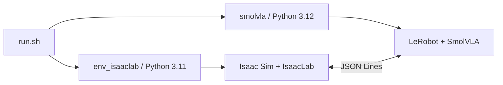

# 复现与部署

本文档说明如何把代码、两个 Conda 环境、外部仓库、场景资产、基础模型、数据集和 checkpoint 在另一台 Ubuntu 工作站上对齐。若环境已经准备好，只想运行实验，请转到 [完整流水线](PIPELINE.md)。

## 1. 复现边界

一个可运行副本由六类对象组成：

| 对象 | Git 是否包含 | 完整性依据 |
|---|---:|---|
| 主项目代码 | 是 | 主仓库 commit |
| LeRobot | submodule 指针 | submodule commit |
| IsaacLab/Isaac Sim | 否 | checkout commit、安装版本 |
| 场景与机器人资产 | 部分 | `local_assets/.../manifest.json`、项目 `assets/` |
| SmolVLM2 基础模型 | 否 | Hub revision 或文件校验值 |
| 数据集与 checkpoint | 否 | `meta/s4_contract.json`、训练配置与 checkpoint step |

仅仅 clone 代码不能直接 Rollout。场景资产、模型、匹配的数据集和 checkpoint 必须另外准备。

## 2. 已验证软件基线

当前工作站快照记录在 `environment/versions.md`。核心版本如下：

| 组件 | 已记录版本 |
|---|---|
| Ubuntu | 22.04.5 LTS |
| NVIDIA driver | 580.159.03 |
| PyTorch CUDA | 12.8 |
| Isaac Sim | 5.1.0.0 |
| IsaacLab | 0.54.2，Git `37ddf626871758333d6ed89cf64ad702aef127d0` |
| LeRobot | 0.6.1，Git `3f2179f3b69708b6ad009b2e7685dd9d05269ee1` |
| `env_isaaclab` | Python 3.11.15 |
| `smolvla` | Python 3.12.13 |

上述补丁版本是 2026-08-07 工作站快照。另有一条独立的 Docker 验证记录：`full-v4-r1` 在 Ubuntu 22.04、driver 570.190、8×RTX 4090 上实际运行 Python 3.11.16/3.12.14，并通过 CUDA 12.8、EGL Vulkan、Isaac Camera RGB、真实 Rollout、单卡 resume 和双卡 DDP 反向传播。Conda 工作站快照与 Docker release snapshot 不应混写成一个精确环境。

版本快照是已知工作组合，不表示任意新版本都兼容。特别不要独立升级 LeRobot、Transformers、PyAV 或 IsaacLab 后继续使用旧 checkpoint。

## 3. 克隆仓库

```bash
git clone --recurse-submodules <YOUR_REPOSITORY_URL> smolVLA
cd smolVLA
git submodule status
```

预期结构：

```text
smolVLA/
├── .gitmodules
├── lerobot/
└── s4_smolvla_isaaclab/
```

已有主仓库但缺少 LeRobot 时：

```bash
git submodule update --init --recursive
```

部署时记录版本：

```bash
git rev-parse HEAD
git submodule status
git -C /path/to/IsaacLab rev-parse HEAD
```

## 4. 创建环境

### 4.1 IsaacLab 环境

```bash
cd /path/to/smolVLA/s4_smolvla_isaaclab
conda env create -f environment/isaaclab.yml
conda activate env_isaaclab
python -m pip install --upgrade pip
```

按照 Isaac Sim 5.1 Python 安装方式安装完整包：

```bash
python -m pip install 'isaacsim[all,extscache]==5.1.0' \
  --extra-index-url https://pypi.nvidia.com
```

然后安装固定 IsaacLab checkout：

```bash
cd /path/to/IsaacLab
./isaaclab.sh --install none
```

该环境负责场景、物理、专家控制、HDF5 采集和 Rollout simulator。

### 4.2 SmolVLA 环境

```bash
cd /path/to/smolVLA/s4_smolvla_isaaclab
conda env create -f environment/smolvla.yml
conda activate smolvla
python -m pip install -e /path/to/smolVLA/lerobot
```

该环境负责 HDF5 转换、LeRobotDataset 检查、训练、离线预览和 Policy Server。

### 4.3 为什么使用两个环境



在线 Rollout 由 IsaacLab 主进程启动独立的 SmolVLA Policy Server。两个环境不共享 Python ABI，只通过明确协议交换观测和动作。

> Rollout-only 不是单环境模式。当前 `run.sh rollout` 同时需要 `env_isaaclab` 和 `smolvla`：前者运行仿真，后者加载 checkpoint 并执行策略推理。只有采集和场景预览不需要 `smolvla`；只做数据转换、检查、训练或离线预览则不需要启动 Isaac Sim。

训练入口 `bash run.sh train` 只读取 `smolvla` 环境，可部署到不安装 Isaac Sim/IsaacLab 的训练服务器。
单机多 GPU 使用 `--num-gpus N` 启动 Accelerate DDP。仓库顶层提供的完整 Docker 发布方式会把基础模型、当前数据集和训练输出放入镜像，并在首次 Compose 启动时初始化持久命名卷；后续新增的数据与 checkpoint 保存在卷中。具体参数见 [PIPELINE.md](PIPELINE.md#单机多-gpu-ddp) 和顶层 `docker/README.md`。

Docker 部署的职责边界是：宿主提供 NVIDIA driver、device nodes 和 Container Toolkit；镜像提供 CUDA userspace、PyTorch、Vulkan/EGL loader、Isaac、LeRobot 和固定训练依赖。宿主 `/usr/local/cuda` 不是容器 CUDA compatibility 的主要判断依据。部署顺序应为 `host_preflight → docker load/build → verify-train/verify-rollout → 真实任务`。

## 5. 导出当前两个环境

维护者应在确认环境可运行后导出“可读环境”和“精确包快照”。建议提交到 `environment/locks/`，文件名包含平台和日期。

```bash
cd /path/to/smolVLA/s4_smolvla_isaaclab
mkdir -p environment/locks

conda env export -n env_isaaclab --no-builds \
  | sed '/^prefix: /d' \
  > environment/locks/env_isaaclab.full.yml

conda env export -n smolvla --no-builds \
  | sed '/^prefix: /d' \
  > environment/locks/smolvla.full.yml

conda list -n env_isaaclab --explicit \
  > environment/locks/env_isaaclab.linux-64.explicit.txt

conda list -n smolvla --explicit \
  > environment/locks/smolvla.linux-64.explicit.txt

conda run -n env_isaaclab python -m pip freeze \
  > environment/locks/env_isaaclab.pip-freeze.txt

conda run -n smolvla python -m pip freeze \
  > environment/locks/smolvla.pip-freeze.txt

bash environment/collect_versions.sh \
  > environment/locks/workstation-versions.txt
```

三类文件用途不同：

- `*.full.yml`：方便在相近 Linux 平台重建，包含 Conda 与 pip 依赖；
- `*.explicit.txt`：锁定 Conda 构建，平台相关，不能代替 pip freeze；
- `*.pip-freeze.txt`：审计 pip 包，不能恢复外部 editable checkout 的正确 commit。

完整导出适合审计当前工作站，但不能未经检查就当作跨机器安装文件。`conda env export` 会把 editable checkout 改写成普通的 `package==version`，而 `+cu128` PyTorch、私有/本地项目和额外 pip index 也不一定能在新机器自动恢复。

当前导出检查结果：

- 两个 `*.full.yml` 的环境名、Python 版本正确，且没有残留绝对 `prefix:`；
- 两个 `*.explicit.txt` 都是 `linux-64`，只锁定 Conda 包，不包含完整 pip 环境；
- `pip-freeze` 正确记录了 LeRobot commit `3f2179f3...` 和 IsaacLab commit `37ddf626...`；
- `env_isaaclab.full.yml` 还包含当前工作站的 Unitree、teleoperation 和 IsaacLab 示例/RL 包，不是 VLA 主链路的最小环境；
- 当前尚缺 `workstation-versions.txt`，应在后台采集结束后补充；
- `teleimager` 的 freeze URL 含特殊相对 subdirectory，不能作为可靠的新机器安装入口。

因此，当前推荐恢复方式仍是使用仓库维护的基础环境文件，再安装固定外部 checkout：

```bash
conda env create -f environment/isaaclab.yml
conda env create -f environment/smolvla.yml
```

随后安装 Isaac Sim 5.1，并重新安装或确认外部 editable 仓库：

```bash
conda activate env_isaaclab
cd /path/to/IsaacLab
./isaaclab.sh --install none

conda activate smolvla
python -m pip install -e /path/to/smolVLA/lerobot
```

`environment/locks/` 用来核对实际包版本和发现差异；在发布为“一键环境文件”之前，应先从 full export 中移除工作站无关包，并在干净机器试装。不要把另一平台的显卡驱动、editable 本地路径或未经验证的 freeze URL 当成可移植依赖。

## 6. 场景资产

运行时默认从以下目录读取：

```text
local_assets/isaac/5.1/
```

维护者已有完整 Isaac 5.1 资产库时，可以生成最小依赖包：

```bash
ISAAC_ASSET_ROOT=/path/to/Assets/Isaac/5.1 \
  bash run.sh prepare-assets --verify
```

把整个 `local_assets/isaac/5.1/` 打包分发。接收者解压后至少应看到：

```text
local_assets/isaac/5.1/manifest.json
local_assets/isaac/5.1/Isaac/Environments/Simple_Warehouse/warehouse.usd
local_assets/isaac/5.1/Isaac/Props/Sektion_Cabinet/sektion_cabinet_instanceable.usd
local_assets/isaac/5.1/Isaac/Props/YCB/Axis_Aligned/005_tomato_soup_can.usd
local_assets/isaac/5.1/Isaac/Props/UIElements/frame_prim.usd
```

缺少 MDL 或贴图会导致红色材质、黑暗背景或纹理丢失。缺少 UIElements 会导致调试坐标系创建失败。不要用调灯光来掩盖资产错误。

## 7. 基础模型、数据集和 checkpoint

训练使用：

```text
models/HuggingFaceTB/SmolVLM2-500M-Video-Instruct/
```

直接 Rollout 需要一起分发：

```text
datasets/lerobot_data/s4_drawer_insert_close_v4_12phase_serial_acquire/
outputs/train/smolvla_drawer_insert_close_v4_12phase_serial_acquire/
```

不能只复制单个权重文件。checkpoint 至少需要完整 `pretrained_model/`，训练续跑还需要 `training_state/` 和完整 `checkpoints/last`。

发布资产、模型、数据和 checkpoint 时建议附带：

- 文件或压缩包 SHA-256；
- 项目、LeRobot、IsaacLab commit；
- 模型 Hub revision；
- 数据集 `meta/s4_contract.json`；
- checkpoint step 和生成它的数据集名称。

## 8. `.env` 配置

```bash
cd /path/to/smolVLA/s4_smolvla_isaaclab
cp .env.example .env
```

按本机路径编辑：

```dotenv
S4_PROJECT_ROOT=/path/to/smolVLA/s4_smolvla_isaaclab
ISAACLAB_ROOT=/path/to/IsaacLab
ISAAC_ASSET_ROOT=/path/to/isaacsim_assets/Assets/Isaac/5.1
S4_SCENE_ASSET_ROOT=/path/to/smolVLA/s4_smolvla_isaaclab/local_assets/isaac/5.1
LEROBOT_ROOT=/path/to/smolVLA/lerobot
SMOLVLA_MODEL_ROOT=/path/to/smolVLA/s4_smolvla_isaaclab/models
S4_DATA_ROOT=/path/to/smolVLA/s4_smolvla_isaaclab/datasets
S4_OUTPUT_ROOT=/path/to/smolVLA/s4_smolvla_isaaclab/outputs
S4_CACHE_ROOT=/path/to/smolVLA/s4_smolvla_isaaclab/.cache
S4_ISAACLAB_ENV=env_isaaclab
S4_SMOLVLA_ENV=smolvla
```

## 9. 分层验收

第一层：入口与环境，不要求数据和 checkpoint。

```bash
bash run.sh help
bash run.sh doctor
bash run.sh list-tasks
bash run.sh activate-task drawer_insert_close
```

第二层：场景。

```bash
bash run.sh sim
```

确认材质、光照、机器人、抽屉、罐子和三路相机正常。

第三层：已有数据集和 checkpoint 的严格检查。

```bash
bash run.sh doctor --strict

bash run.sh dataset-check \
  datasets/lerobot_data/s4_drawer_insert_close_v4_12phase_serial_acquire \
  --checkpoint outputs/train/smolvla_drawer_insert_close_v4_12phase_serial_acquire/checkpoints/<STEP>/pretrained_model
```

第四层：固定场景 Rollout。

```bash
bash run.sh rollout \
  --deterministic \
  --checkpoint outputs/train/smolvla_drawer_insert_close_v4_12phase_serial_acquire/checkpoints/<STEP>/pretrained_model \
  --dataset-root datasets/lerobot_data/s4_drawer_insert_close_v4_12phase_serial_acquire \
  --policy-device cuda
```

第五层：20 轮随机主罐位置成功率。

```bash
bash run.sh rollout \
  --headless \
  --success-rate 20 \
  --checkpoint outputs/train/smolvla_drawer_insert_close_v4_12phase_serial_acquire/checkpoints/<STEP>/pretrained_model \
  --dataset-root datasets/lerobot_data/s4_drawer_insert_close_v4_12phase_serial_acquire \
  --policy-device cuda
```

## 10. 常见部署错误

| 现象 | 优先检查 |
|---|---|
| `lerobot/` 为空 | 是否递归 clone，`.gitmodules` 是否正确 |
| `import isaaclab` 失败 | 是否在 `env_isaaclab` 安装了固定 IsaacLab checkout |
| Policy Server 启动失败 | `smolvla` 环境、LeRobot commit、基础模型路径 |
| 背景红色或纹理缺失 | 资产 manifest、MDL 和贴图闭包 |
| 找不到 `frame_prim.usd` | `Isaac/Props/UIElements/` 是否完整 |
| dataset-check 语言顺序不匹配 | 是否用了旧数据集或转换时任务契约不一致 |
| checkpoint 拒绝 Rollout | dataset/checkpoint contract 不一致或 checkpoint 不完整 |
| 显示卡死或内存上涨 | 检查残留训练 worker、CPU powersave、并发仿真进程 |
| 容器 CUDA 通过但 Vulkan 失败 | 检查 graphics capability、EGL NVIDIA ICD、Container Toolkit 注入；拒绝 llvmpipe |
| `accelerate` 把 `lerobot-train` 当本地文件 | 必须使用 `full-v4-r1`/当前脚本，由入口传绝对 console-script 路径 |
| Resume 加载 optimizer 时 OOM | 先看 `nvidia-smi` 中其他 PID 和容器物理卡映射；显存被占满时减 batch 不能解决加载阶段 OOM |
| Camera verify `SIGSEGV 139`，独立脚本成功 | 使用当前独立 `scripts/verify_isaac_camera.py`，不要恢复长 `python -c` 形式 |

## 11. 复现验收清单

- [ ] 主仓库、LeRobot、IsaacLab commit 已记录；
- [ ] 两个环境版本与导出清单一致；
- [ ] `.env` 全部指向本机有效路径；
- [ ] 场景资产 manifest 完整；
- [ ] SmolVLM2 基础模型完整；
- [ ] 数据集和 checkpoint 来自同一语言与特征契约；
- [ ] `bash run.sh doctor` 通过；
- [ ] 场景显示正常；
- [ ] `dataset-check --checkpoint` 通过；
- [ ] 固定场景 Rollout 能生成视频、CSV 和 summary；
- [ ] 随机成功率记录了 checkpoint、seed、配置和输出目录。

安装命令中的 Isaac Sim 5.1 pip 形式来自 NVIDIA 官方 Python 环境安装说明；IsaacLab 的 `./isaaclab.sh --install` 来自其官方本地安装流程。项目实际兼容性仍以本仓库锁定版本和 `doctor` 结果为准。
