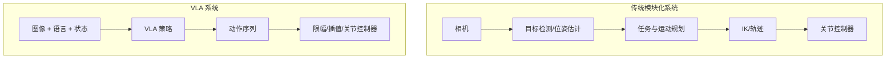
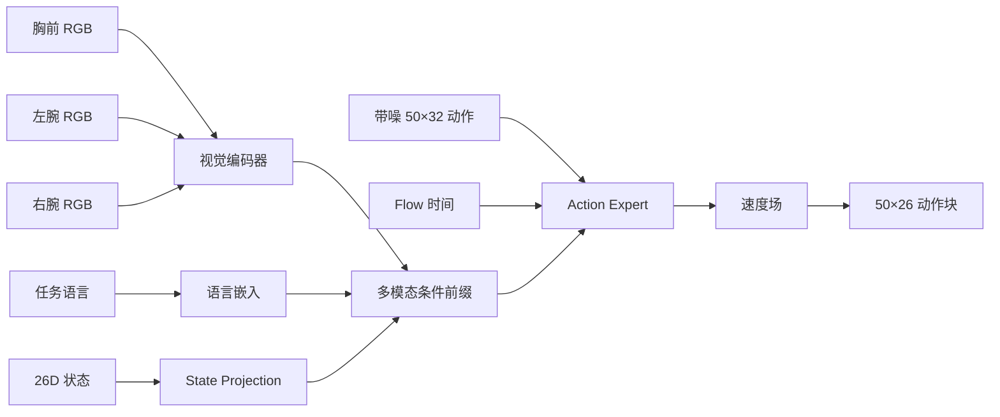
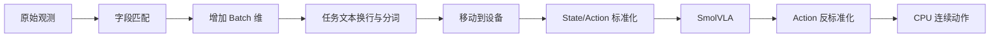
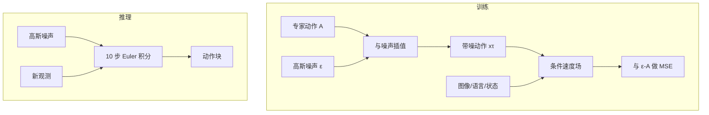
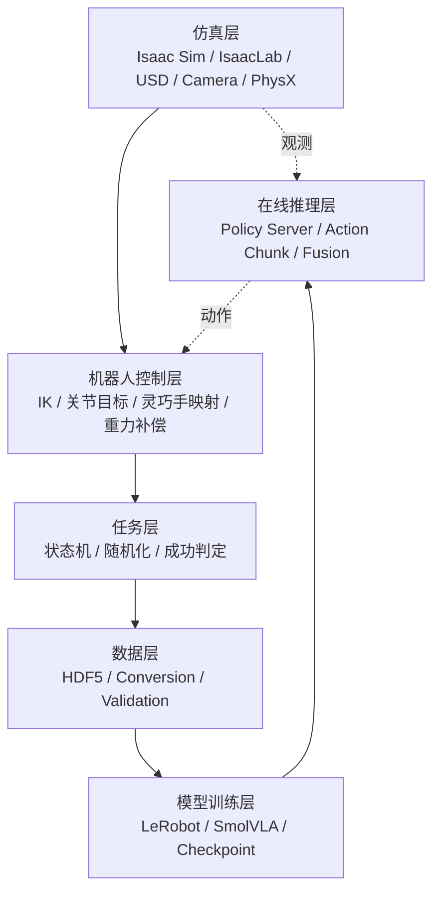
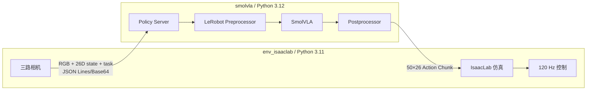
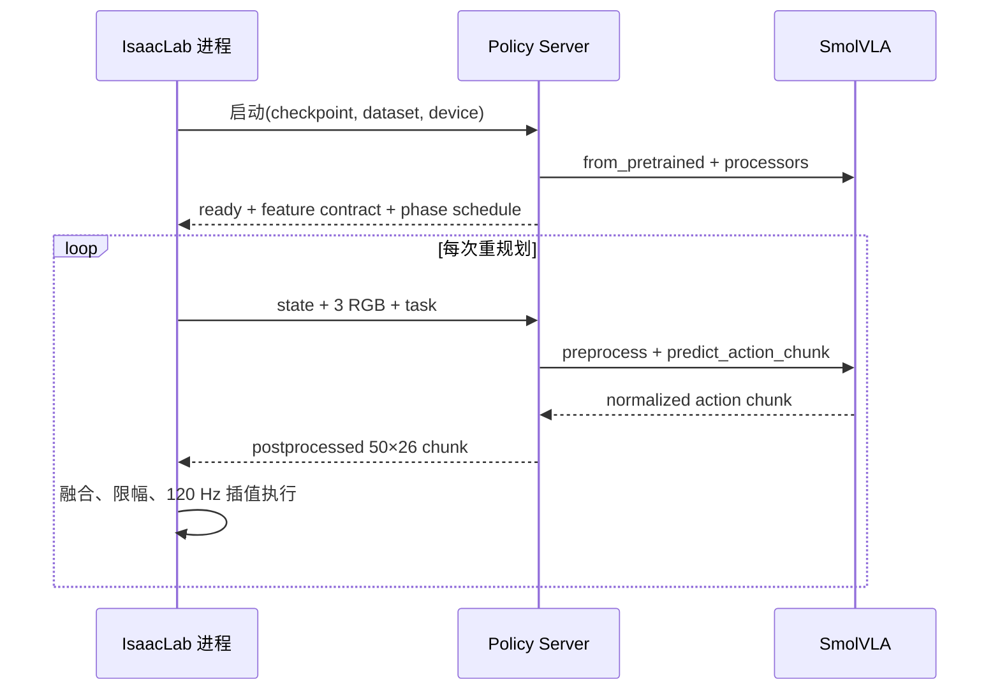
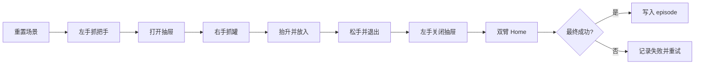
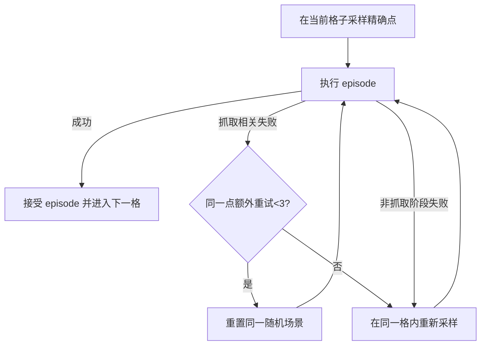

# 第一章：SmolVLA 原理与任务设计

> 导航：[课程索引](SMOLVLA_ADVANCED_TECHNICAL_COURSE.md) · **第一章** · [第二章：项目实现](02_PROJECT_IMPLEMENTATION.md) · [第三章：完整部署](03_PROJECT_DEPLOYMENT.md)

本章从 VLA 和 SmolVLA 的模型原理出发，逐步建立项目架构、核心数据契约和仿真任务设计方法。阅读本章不要求先运行项目；重点是理解后续实现为什么采用三路视觉、26D 绝对关节动作、Action Chunk、分层随机化和独立 Policy Server。

---

## 1.1 VLA 与 SmolVLA 的基本原理

### 本节目标

理解 VLA 在机器人系统中的位置，以及当前 LeRobot 实现中的 SmolVLA 如何把图像、语言和机器人状态转换成连续动作序列。

### 1.1.1 从模块化机器人系统到学习策略

传统机器人系统通常将任务拆成感知、状态估计、任务规划、运动规划和控制等模块。它的优势是约束明确、容易单独验证；缺点是每个模块需要建模，复杂视觉和接触任务中的误差会跨模块传播。

模仿学习（Imitation Learning）通过专家示范学习策略。最直接的方法是行为克隆（Behavior Cloning, BC）：给定专家观测与动作对，训练模型预测专家动作。VLA 在此基础上增加了视觉和语言条件，让同一个策略接口可以同时处理场景信息、任务语义和机器人自身状态。



VLA 并没有消除底层系统。它改变的是“如何产生策略动作”，而动作是否安全、能否跟踪、是否发生碰撞，仍由机器人控制与物理系统决定。

> 技术要点：VLA 输出动作，但真正执行动作的仍然是机器人控制系统。

### 1.1.2 VLA 的输入与输出

在时刻 (t)，可以把多模态观测写成：

\[
o_t=\{I_t^1,I_t^2,\ldots,I_t^K,s_t,\ell\}
\]

其中：

- (I_t^k) 是第 (k) 路相机图像；
- (s_t) 是机器人当前状态；
- (ell) 是自然语言任务；
- (o_t) 是送入策略的完整条件。

本项目的实际输入输出如下。

| 模态 | 当前字段 | 含义 |
|---|---|---|
| Vision | `chest_front_rgb` | 全局任务、双臂、抽屉和物体关系 |
| Vision | `left_wrist_rgb` | 左手与把手、抽屉的局部关系 |
| Vision | `right_wrist_rgb` | 右手与罐子的近距离关系 |
| Language | task text | 当前阶段或任务动作描述 |
| State | `observation.state` | 26D 双臂和灵巧手状态 |
| Action | `action` | 26D 绝对关节目标 |

VLA 与常见方法的边界是：

| 方法 | 主要条件 | 主要输出 | 典型限制 |
|---|---|---|---|
| 传统视觉抓取 | 图像、标定、物体模型 | 抓取位姿 | 通常任务范围窄 |
| 端到端 BC | 观测 | 动作 | 未必具有语言接口 |
| 强化学习 | 状态、奖励 | 动作 | 奖励和交互成本高 |
| LLM 任务规划 | 文本、符号状态 | 高层步骤 | 不直接产生高频连续动作 |
| VLA | 图像、语言、机器人状态 | 连续动作或动作块 | 强依赖示范覆盖和闭环设计 |

### 1.1.3 SmolVLA 的定位

**官方资料**将 SmolVLA 定位为轻量级、约 450M 参数的 VLA。它由视觉语言模型（Vision-Language Model, VLM）和动作专家（Action Expert）组成，目标是在较低训练与推理成本下学习通用的视觉语言条件机器人策略。

当前本地 LeRobot 实现使用 `SmolVLM2-500M-Video-Instruct` 作为 VLM 基座。图像 token、语言 token 和投影后的机器人状态组成条件前缀；带噪动作与扩散时间组成动作后缀；动作专家预测将噪声轨迹转向专家动作的速度场。



图中的 32 是模型动作 padding 上限，真正输出给本项目的是去除 padding 后的 26 维动作。

### 1.1.4 Action Chunk

SmolVLA 不是只预测一个动作，而是预测长度为 (H) 的动作块：

\[
A_t=[a_t,a_{t+1},\ldots,a_{t+H-1}]
\]

当前训练配置中 (H=50)。在 20 Hz 数据频率下，完整动作块覆盖 2.5 秒。但这不表示 Rollout 必须盲目执行 2.5 秒：当前在线控制默认每 40 个策略帧，即 2 秒，重新获取观测并预测新动作块。

```text
策略帧:      0---------19 20--------39 40--------
Chunk A:     [=============== 50 frames ===============]
Chunk B:                    [=============== 50 frames ===============]
Chunk C:                                  [=============== 50 frames ===============]
重规划:      ^            ^             ^
             0 s          1 s           2 s
```

Action Chunk 的收益是让模型学习运动的局部时间结构，并减少逐帧推理开销。代价是动作块越长、重规划越慢，模型越不容易根据新视觉状态纠偏。

### 1.1.5 State/Action normalization

机器人不同关节的数值范围可能不同。直接使用原始数值会让大范围维度主导损失，因此 LeRobot 的 preprocessor 使用数据集统计量对状态和动作做 mean-std 标准化：

\[
\hat{x}=\frac{x-\mu}{\sigma+\epsilon}
\]

推理后，postprocessor 再恢复物理量：

\[
x=\hat{x}(\sigma+\epsilon)+\mu
\]

当前 SmolVLA processor 的顺序可以概括为：



图像使用 `IDENTITY` normalization，但仍进行模型侧的缩放、padding 和视觉编码。状态和动作使用 `MEAN_STD`。

### 1.1.6 Flow Matching 动作学习

训练时，设专家动作块为 (A)，高斯噪声为 (epsilon)，随机时间为 (	au\in(0,1])。当前实现构造：

\[
x_\tau=\tau\epsilon+(1-\tau)A
\]

当 (	au\rightarrow1) 时，输入接近噪声；当 (	au\rightarrow0) 时，输入接近专家动作。目标速度为：

\[
u_\tau=\epsilon-A
\]

模型学习条件速度场：

\[
\mathcal{L}=\mathbb{E}\left[
\left\|v_\theta(x_\tau,\tau,o_t)-u_\tau\right\|_2^2
\right]
\]

其中 (v_\theta) 是动作专家，(o_t) 是图像、语言和状态条件。当前源码对每个动作时间步和动作维度计算 MSE，并屏蔽越过 episode 末尾的 padding 动作。

推理从噪声出发，当前 LeRobot 默认用 10 个 Euler 步沿反向时间积分：

```python
x = gaussian_noise(shape=(batch, chunk_size, max_action_dim))
for step in range(num_steps):
    t = 1.0 - step / num_steps
    velocity = model(x, t, images, language, state)
    x = x - velocity / num_steps
return x[..., :real_action_dim]
```

这段伪代码表达算法关系，不是项目脚本的逐行复制。



### 1.1.7 能力边界

SmolVLA 的主要优势是多模态条件、连续动作块和较低计算成本，但仍有以下限制：

- **数据分布依赖**：训练中没覆盖的物体位置和视觉变化可能导致失败；
- **闭环分布偏移**：小动作误差会让下一帧观测偏离专家轨迹；
- **长时序误差累积**：前面阶段的误差会传到后续接触阶段；
- **接触不稳定**：关节误差很小也可能改变手指与物体接触；
- **无内建碰撞保证**：策略输出不自动满足避障和力学稳定性；
- **动作多解性**：同一场景可能存在多条合理轨迹，简单平均会产生不自然动作。

### 本节小结

VLA 把图像、语言和机器人状态映射为动作。SmolVLA 使用 VLM 条件特征和 Flow Matching 动作专家生成动作块；标准化、动作 padding 和 Action Chunk 是训练接口的一部分。它是策略层，不替代 IK、控制器、碰撞、物理仿真和成功判定。

---

## 1.2 项目整体架构与核心契约

### 本节目标

理解当前项目如何把 Isaac Sim、IsaacLab、LeRobot 和 SmolVLA 组成一个系统，以及哪些接口必须贯穿采集、转换、训练和 Rollout 保持一致。

### 1.2.1 六层系统架构



各层职责如下：

| 层 | 负责 | 不负责 |
|---|---|---|
| 仿真 | 场景、物理、传感器、关节状态 | 学习专家策略 |
| 控制 | IK、关节目标、动作映射、跟踪 | 判断模型泛化 |
| 任务 | 阶段、随机化、门控、成功条件 | 训练神经网络 |
| 数据 | 同步记录、格式转换、质量检查 | 自动修复坏示范 |
| 训练 | 批次、标准化、优化、checkpoint | 保证闭环物理成功 |
| 推理 | 观测编码、动作块、融合和执行 | 替代任务成功判定 |

### 1.2.2 Isaac Sim、IsaacLab、LeRobot 与 SmolVLA

- **Isaac Sim** 提供 USD 场景、RTX 相机、PhysX 和关节仿真。
- **IsaacLab** 提供仿真应用启动、资产封装、机器人 articulation、传感器和控制接口。
- **LeRobot** 提供统一数据集、processor、训练器、checkpoint 和策略接口。
- **SmolVLA** 是 LeRobot 中的策略模型，消费多模态观测并预测动作块。
- **本项目代码** 将四者连接，定义 S4 机器人契约、抽屉任务和完整流水线。

`run.sh` 是统一入口，但它不是业务逻辑本身。它负责选择环境、解析顶层命令并调用相应脚本。

### 1.2.3 双 Python 环境和 Policy Server

IsaacLab 当前运行在 Python 3.11 环境，当前 LeRobot 版本面向 Python 3.12+。把两者强行装入同一环境容易造成 PyTorch、CUDA、Transformers 和 Isaac 扩展冲突。因此在线 Rollout 使用两个进程。



启动握手中，Policy Server 返回 image keys、图像 shape、state/action 维度、设备和从数据集恢复的阶段计划。任何 visual feature 缺失、多余或尺寸不符都会报错。



### 1.2.4 当前核心数据契约

当前任务配置定义：

| 项目 | 当前值 |
|---|---|
| Task ID | `drawer_insert_close` |
| Schema | `s4_bimanual_v1` |
| Control mode | `bimanual` |
| Action semantics | `absolute_joint_target` |
| State | 26D `float32` |
| Action | 26D `float32` |
| Dataset FPS | 20 Hz |
| Control FPS | 120 Hz |
| 图像 | 3 路 680×480 RGB |
| Dataset ID | `local/s4_drawer_insert_close_v3_10phase_safe_handle_clear` |

策略张量通常采用 CHW，因此模型配置中的图像 shape 为 `[3,480,680]`；HDF5 和视频帧采用 HWC，即 `[480,680,3]`。二者是同一图像的不同内存布局。

#### 26D state/action

| 切片 | 内容 | 维度 |
|---|---|---:|
| `[0:7]` | 左臂 7 个关节 | 7 |
| `[7:13]` | 左手 6 个策略控制 | 6 |
| `[13:20]` | 右臂 7 个关节 | 7 |
| `[20:26]` | 右手 6 个策略控制 | 6 |

每只手的 6 个策略控制是：拇指 yaw、拇指 pitch、食指、中指、无名指和小指。真实 URDF 还有 mimic joints；`s4_robot/control_mapping.py` 将 6D 策略动作扩展到实际驱动关节。模型不应直接学习一套与仿真执行不同的关节顺序。

```text
26D action
├── Left Arm  [7]
├── Left Hand [6] ── mimic expansion ──> hand drive joints
├── Right Arm [7]
└── Right Hand[6] ── mimic expansion ──> hand drive joints
```

### 1.2.5 绝对动作、命令和实际状态

本项目动作语义是绝对关节目标：

\[
a_t=q^{target}_t
\]

它不是关节增量 (q_t-q_{t-1})，也不是力矩。在线系统中还要区分：

| 名称 | 含义 |
|---|---|
| Policy action | 模型反标准化后的 26D 绝对目标 |
| Fused action | 多个动作块及阶段边界融合后的目标 |
| Command | 经过裁剪、限速后交给插值器的 endpoint |
| Actual state | 执行一个控制区间后从仿真读取的真实关节位置 |

若训练时记录的是绝对目标，Rollout 却把它当增量相加，机器人会立即偏离数据分布。因此 action semantics 必须写入数据契约，并在转换和 checkpoint 检查中保留。

### 1.2.6 资产与可移植路径

`.env.example` 通过以下根目录表达外部依赖：

```bash
ISAACLAB_ROOT=/path/to/IsaacLab
ISAAC_ASSET_ROOT=/path/to/isaacsim_assets/Assets/Isaac/5.1
S4_SCENE_ASSET_ROOT=/path/to/s4_smolvla_isaaclab/local_assets/isaac/5.1
LEROBOT_ROOT=/path/to/lerobot
SMOLVLA_MODEL_ROOT=/path/to/s4_smolvla_isaaclab/models
```

配置文件使用变量拼接相对资产结构，避免把某个用户的 `/home/...` 写进任务定义。课程中的命令也以项目根目录为当前目录，不写死本机路径。

### 本节小结

当前项目由仿真、控制、任务、数据、训练和推理六层组成。双 Python 环境通过 Policy Server 隔离。26D 顺序、三路相机、20 Hz 数据频率和绝对关节动作是贯穿完整链路的核心契约。

---

## 1.3 VLA 仿真任务设计与随机化

### 本节目标

理解如何把双臂抽屉任务设计成既能稳定生成专家数据，又包含足够视觉与初始状态变化的 VLA 学习问题。

### 1.3.1 任务定义

`drawer_insert_close` 要求：左手拉开抽屉，右手抓取番茄汤罐，将罐子放入抽屉，右手退出，左手关闭抽屉，最后双臂返回 Home。



这个任务比单臂 pick-place 更适合作为高级案例，因为它包含：

- 双臂分工和并发动作；
- 灵巧手接触与抓握；
- 可动抽屉与物体之间的物理交互；
- 23 个专家控制阶段、10 个模型语言宏阶段构成的长时序；
- 多个局部成功条件和一个最终成功条件。

### 1.3.2 场景与三路视觉

场景包含 S4 双臂机器人、主抽屉柜、第二柜体、番茄汤主抓取罐和仓库背景。三个
柜面 YCB 干扰物由 `randomization.distractor_cans.enabled` 控制；**当前默认为关闭**，
采集与匹配的 rollout 默认不生成它们。

| 相机 | 主要信息 | 可能盲区 |
|---|---|---|
| 胸前相机 | 全局任务布局、双臂和抽屉状态 | 近距离手指接触细节不足 |
| 左腕相机 | 把手、左手和抽屉局部状态 | 难以观察右侧抓取 |
| 右腕相机 | 右手、主罐、放置局部状态 | 全局关系和左手状态不足 |

多视角不是简单增加图像数量。相机顺序和 feature key 是训练契约；训练和 Rollout 若交换左右腕图像，即使尺寸相同，语义也会错位。

### 1.3.3 固定条件与随机条件

当前项目聚焦仿真 VLA，并希望画面稳定、自然，因此光照不做域随机化。随机化集中在与任务泛化直接相关、且可受控的状态上。

| 固定项 | 随机项（当前默认） |
|---|---|
| 机器人基座和柜体布局 | 主罐 XY 位置（`can_xy.enabled=true`） |
| 相机内外参 | |
| 抽屉初始开度（`drawer.initial_open_m=0.00`） | |
| 工作室光照 | |
| 不生成三个干扰物（`distractor_cans.enabled=false`） | |
| 抓取后固定抬升偏移、专家控制逻辑 | |

当前 YAML 已启用主罐 5×5 分层格内连续随机；干扰物区域仍作为可选配方保留，
默认不生成。采集可用 `--no-can-xy-randomization` 临时关闭主罐随机，也可用
`--distractor-cans` 临时打开干扰物。

固定光照减少了不必要的视觉分布宽度，有利于先解决操作策略。

### 1.3.4 主罐连续随机区域（当前启用）

主罐名义位置约为：

\[
p_0=(0.54,-0.13,1.16)\ \mathrm{m}
\]

当 `can_xy.enabled=true` 时，配置给出的偏移为：

\[
\Delta x\in[-0.025,-0.005],\qquad
\Delta y\in[-0.17,0.01]
\]

因此当前世界坐标范围为：

\[
x\in[0.515,0.535],\qquad
y\in[-0.300,-0.120]
\]

面积约为：

\[
2\ \mathrm{cm}\times18\ \mathrm{cm}=36\ \mathrm{cm}^2
\]

这个区域不是 10 cm×10 cm 正方形，而是沿右臂更容易覆盖的方向形成窄长矩形。配置注释记录了设计依据：靠近桌面物理边缘的旧位置存在掉落风险，而更远的角落会进入较差的 IK 条件带。

> 当前配置可以证明区域定义；“区域内所有物理抓取必然成功”尚未被本次写作重新验证。

### 1.3.5 5×5 分层网格内随机（当前启用）

当 `can_xy.enabled=true` 时，矩形被划分为 5×5 个格子。每轮 25 个格子使用 RNG 生成随机排列，每个格子内部再均匀连续采样。

```text
y=-0.120  ┌────┬────┬────┬────┬────┐
          │ ·  │  · │ ·  │   ·│ ·  │  每个 · 都是格内随机点
          ├────┼────┼────┼────┼────┤
          │  · │ ·  │  · │ ·  │  · │
          ├────┼────┼────┼────┼────┤
          │ ·  │   ·│ ·  │  · │ ·  │
          ├────┼────┼────┼────┼────┤
          │  · │ ·  │   ·│ ·  │ ·  │
          ├────┼────┼────┼────┼────┤
y=-0.300  │ ·  │  · │ ·  │ ·  │   ·│
          └────┴────┴────┴────┴────┘
          x=.515                    x=.535
```

三种采样方式的差别如下：

| 方法 | 空间覆盖 | 重复性 | 当前项目 |
|---|---|---|---|
| 25 个固定点 | 均匀但离散 | 高 | 否 |
| 全区域均匀随机 | 可能短期聚集 | 中 | 否 |
| 分层格内随机 | 保证格子覆盖且点连续 | 可由 seed 复现 | 是 |

采样器保存 `order`、`cursor` 和 `cycle`，因此断点续采可以延续网格遍历，而不是从第一格重新开始。

### 1.3.6 失败后的采样策略

当前逻辑与早期“一个格子三个点都失败就跳过”不同：



`max_grasp_retries_same_position: 3` 表示初始尝试之外再重试 3 次，即同一个精确位置最多尝试 4 次。重试耗尽后仍停留在当前格子，只替换格内精确点。格子只有接受成功 episode 后才推进。

这样做的含义是：数据集不会因为困难格子被跳过而产生空间空洞，但若某个格子系统性不可执行，采集可能持续失败。因此正式采集前仍需要工作空间验证和小规模可视化试跑。

### 1.3.7 其他场景变量

抽屉初始开度已从随机变量中移除，采集和 rollout 都固定为：

\[
q_{drawer}^{init}=0.00\ \mathrm{m}
\]

三个干扰物（当前默认 **`distractor_cans.enabled=false`，不生成**）配方为以下 YCB
资产，并在三个互相分离的柜面区域放置：

- `002_master_chef_can.usd`
- `006_mustard_bottle.usd`
- `021_bleach_cleanser.usd`

启用时最小中心距离为 0.16 m，主抓取罐附近不放干扰物。抓取后的抬升随机化当前关闭，采用固定目标偏移，以减少接触成功后的轨迹方差。

### 1.3.8 可达不等于可抓

随机点需要通过逐层筛选：


离线 IK 检查通常只能覆盖 B～D。小拇指是否碰桌面、手指是否先蹭到罐子、摩擦是否足以抬升，需要物理仿真验证。重力补偿也属于执行期因素：它能减小手臂下垂，却不能把错误抓取几何变成正确抓取。

### 1.3.9 阶段完成与最终成功

阶段门控用于判断“是否可以进入下一阶段”，最终成功用于判断“是否把 episode 写入数据集”。当前最终成功条件是：

\[
|q_{drawer}|<0.04\ \mathrm{m},\qquad
1.00<z_{can}<1.04\ \mathrm{m}
\]

注意它主要检查抽屉关闭程度与罐子世界高度，没有严格使用抽屉局部 XY 包围盒验证罐子位于抽屉内部。这是当前实现边界，不能把它描述成完整几何包含测试。

### 本节小结

当前任务通过固定光照、三路相机、已启用的主罐分层格内随机和可选的远离抓取区
干扰物构造数据变化。抽屉固定从关闭状态开始，当前默认启用主罐 XY 随机、关闭干扰物；运动学可达
只是必要条件，物理抓取稳定性仍需在仿真中验证。

---

**继续阅读：**[第二章：项目实现与端到端闭环](02_PROJECT_IMPLEMENTATION.md)
