# 第二章：项目实现与端到端闭环

> 导航：[课程索引](SMOLVLA_ADVANCED_TECHNICAL_COURSE.md) · [第一章：核心原理](01_SMOLVLA_PRINCIPLES.md) · **第二章** · [第三章：完整部署](03_PROJECT_DEPLOYMENT.md)

本章以 `drawer_insert_close` 为贯穿案例，说明理论如何落实为脚本化专家、HDF5 数据、LeRobotDataset、SmolVLA 训练和在线闭环控制。内容以当前配置和代码为准，命令均从 `run.sh` 的真实入口出发。

---

## 2.1 脚本化专家策略与机器人控制

### 本节目标

理解高质量专家示范如何由状态机、IK、灵巧手控制和物理门控共同生成，以及为什么专家策略质量构成训练数据质量的上限。

### 2.1.1 专家策略与学习策略

脚本化专家掌握任务几何、目标和阶段逻辑，使用 IK 和关节目标生成确定性较强的示范；训练后的 SmolVLA 不直接读取这些几何真值，而是根据图像、语言和机器人状态预测动作。

| 对比 | 脚本化专家 | SmolVLA 策略 |
|---|---|---|
| 输入 | 仿真真值、Anchor、任务状态 | 图像、语言、26D 状态 |
| 逻辑 | 显式状态机 | 数据驱动条件生成 |
| 动作 | IK/关节目标 | Flow Matching 动作块 |
| 失败检查 | 显式门控 | 需要外部闭环判断 |
| 用途 | 生成训练示范 | 在线控制 |

如果专家本身经常碰倒罐子、在闭手过程中移动手臂或放置后过早退出，模型会把这些行为当成正确目标。因此，先提高专家成功率通常比先增加训练步数更重要。

### 2.1.2 当前 26 阶段状态机

当前 YAML 中实际有 26 个专家控制阶段，并映射为 12 个语言宏阶段。预抓握先在无接触区域稳定，精确接近和闭手随后在同一语言段内连续执行。

| # | 阶段 | 主要目标 | 关键门控 |
|---:|---|---|---|
| 1 | `initial_open_hands` | 双手张开并稳定 | 双手实际位置 |
| 2 | `left_approach_handle` | 左手粗接近 | 左 TCP |
| 3 | `left_approach_handle_fine` | 中间过渡 | 左 TCP |
| 4 | `left_hold_handle_pregrasp` | 张开的左手在预抓握点稳定 | 左手实际张开、0.5 s |
| 5 | `left_grasp_handle` | 从预抓握点精确到达把手 | 左 TCP |
| 6 | `left_close_hand` | 闭合抓把手 | 时间保持 |
| 7 | `left_preload_handle` | 轻微预拉验证抓握耦合 | 抽屉开度 ≥0.003 m |
| 8 | `pull_drawer` | 拉开抽屉 | 抽屉开度 ≥0.08 m |
| 9 | `left_hold_drawer_open` | 稳定保持已拉开的抽屉 | 左 TCP、抽屉开度、0.5 s |
| 10 | `right_pregrasp_can` | 从安全方向到预抓取 | 右 TCP 10 mm、罐位移 ≤20 mm |
| 11 | `right_hold_can_pregrasp` | 张开的右手在预抓握点稳定 | 手实际张开、罐位移、0.5 s |
| 12 | `right_grasp_can` | 精确靠近罐子 | 右 TCP 28 mm、罐位移 ≤20 mm |
| 13 | `right_settle_before_close` | 开手静止 | 1.0 s、手实际到位 |
| 14 | `right_close_hand` | 闭手包裹罐子 | 1.0 s |
| 15 | `right_hold_grasp` | 保持抓握 | 0.5 s |
| 16 | `right_lift_can` | 抬起罐子 | 物体 Z∈[1.20,1.35] m |
| 17 | `right_place_in_drawer` | 移入抽屉 | 右 TCP |
| 18 | `right_open_hand` | 松手并等待稳定 | 手到位、物体边界/速度 |
| 19 | `right_lift_clear_drawer` | 垂直抬手 0.10 m | 右手实际张开 |
| 20 | `right_retreat_clear_drawer` | 向机器人侧和外侧退出 | 手张开、物体边界/速度 |
| 21 | `right_home_after_retreat` | 左手保持抽屉，右臂单独回 Home | 右 Home、抽屉保持打开 |
| 22 | `left_close_drawer` | 右臂保持 Home，左手单独关抽屉 | 抽屉开度 <0.020 m |
| 23 | `left_open_hand` | 原位持续发出左手张开命令 | 保持 1.0 s |
| 24 | `left_clear_handle_after_release` | 左手先向后 4 cm、向上 5 cm 脱离把手 | TCP、实际张开、抽屉关闭 |
| 25 | `left_joint_transition_after_release` | 左臂进入肘部后收关节过渡 | 实际张开、关节误差、抽屉关闭 |
| 26 | `left_home` | 左臂回 Home | Home、手、抽屉门控 |

```mermaid
stateDiagram-v2
    [*] --> OpenHands
    OpenHands --> LeftApproach
    LeftApproach --> HoldLeftPregrasp
    HoldLeftPregrasp --> LeftGrasp
    LeftGrasp --> PreloadHandle
    PreloadHandle --> PullDrawer
    PullDrawer --> HoldDrawerOpen
    HoldDrawerOpen --> RightPregrasp
    RightPregrasp --> HoldRightPregrasp
    HoldRightPregrasp --> RightGrasp
    RightGrasp --> SettleOpen
    SettleOpen --> CloseHand
    CloseHand --> HoldGrasp
    HoldGrasp --> Lift
    Lift --> Place
    Place --> Release
    Release --> LiftClear
    LiftClear --> RetreatClear
    RetreatClear --> RightHome
    RightHome --> CloseDrawer
    CloseDrawer --> LeftRelease
    LeftRelease --> ClearHandle
    ClearHandle --> JointTransition
    JointTransition --> Home
    Home --> [*]
```

状态图将若干细分接近阶段合并为逻辑块，表格保留了真实阶段名。

这些 26 个阶段是**专家控制阶段**，其中包括预抓握稳定、抓把手后的轻微预拉确认、拉开后的
稳定保持，以及关门松手后的后上方脱离；它们不再逐个作为模型语言。当前
`drawer_12phase_v4_serial_acquire` 将相邻控制阶段归并为 12 个语言宏阶段；采集仍执行上述全部
控制动作，并避免在接触点把“精确接近”和“闭手”拆成两个语言段。稳定映射见
工程入口与当前语言契约摘要集中在 `docs/PIPELINE.md`，不能用 prompt 字符串代替阶段 ID 充当程序契约。

### 2.1.3 Anchor 与相对目标

Anchor 是从当前仿真状态测得的参考点，例如初始抽屉把手、打开后的把手和当前罐子。目标通常由 Anchor 加 base frame 偏移得到：

\[
p^{target}=p^{anchor}+\Delta p_{base}
\]

相对目标比固定世界坐标更适合随机化：罐子位置变化时，预抓取、抓取和抬升目标随罐子一起移动。抽屉当前固定从关闭状态开始，但把手和开门目标仍通过实测锚点计算。

一个简化目标配置如下：

```yaml
right_can_grasp:
  anchor: can
  offset_frame: base_link
  offset: [-0.050, -0.038, 0.030]
  rpy: [0.0, -1.4, 0.0]
  orientation_weight: 0.35
```

这表示 TCP 位于罐子 Anchor 的特定一侧和高度。它不是“手指到罐子中心的距离”，因为 TCP 是腕部虚拟参考点，手掌和指尖相对 TCP 还有固定几何偏移。

### 2.1.4 TCP 目标、姿态与 IK

IK 求解关节向量 (q)，使当前 TCP 位姿逼近目标：

\[
q^*=\arg\min_q
w_p\|p(q)-p^*\|^2+w_R d(R(q),R^*)^2+\lambda\|q-q_{ref}\|^2
\]

其中：

- (p^*,R^*) 是目标位置和姿态；
- (w_p,w_R) 控制位置和姿态权重；
- (q_{ref}) 是 null-space 姿态参考；
- 最后一项抑制肘部跳到不自然的 IK 分支。

右手精确抓取阶段使用 `keep_ik_posture_reference: true`，保留预抓取时选定的弯臂分支，避免靠近罐子时突然切换肘部姿态。

```python
target_pose = anchor_pose + configured_offset
q_target = solve_ik(
    tcp_target=target_pose,
    posture_reference=pregrasp_joint_posture,
    orientation_weight=0.35,
)
send_absolute_joint_target(q_target)
```

### 2.1.5 为什么预抓取要从安全方向进入

当前预抓取偏移是 `[-0.12,-0.12,+0.10] m`，精确抓取偏移是 `[-0.050,-0.038,+0.030] m`。预抓取点更靠近机器人、更偏右且更高，目的是让张开的长手指先获得侧向和垂直间隙，再执行短距离精确靠近。

```text
Home ──大范围移动──> 预抓取（远、右、高）
                         │
                         └──慢速精确接近──> 抓取（罐体中部）
```

如果从 Home 直接对准抓取点，张开的手指可能在腕部尚未到位时扫过罐子。此时“TCP 最终能到达”并不能证明路径安全。

### 2.1.6 手臂与手指的时序分离

右手抓取使用“靠近—停稳—闭合—保持—抬升”的顺序：

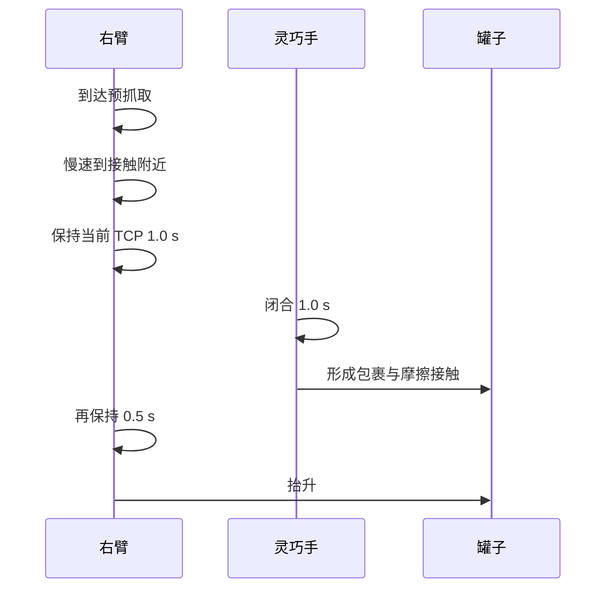

简化门控伪代码：

```python
if tcp_reached and object_displacement <= 0.020:
    hold_arm_pose(seconds=1.0)
    close_hand(seconds=1.0)
    hold_grasp(seconds=0.5)
    lift_arm()
else:
    reject_attempt_and_log()
```

“闭手命令已发送”与“手指实际完成闭合”不同。接触物体后，手指可能因为碰撞而无法到达无物体时的完整 close target；因此抓取阶段要判断闭合进度和物体是否跟随，而不能只要求所有手指精确等于命令角度。

### 2.1.7 位置容差与物体门控

预抓取 TCP 容差是 0.010 m；精确抓取阶段容差是 0.028 m。后者看起来更宽，是因为 TCP 位于腕部而不是指尖：配置注释记录的物理测试显示，张手第一次形成稳定接触时 TCP 误差约 25～27 mm；继续强迫 TCP 进入 10 mm 反而可能用张开的手推罐子。

与此同时，两个阶段都要求罐子相对 episode 开始位置的位移不超过 0.020 m：

\[
\|p_{can,t}-p_{can,0}\|\le 0.020\ \mathrm{m}
\]

这个门控的作用是：如果靠近路径已经碰动罐子，立即丢弃本次尝试，不让后续动作在错误物体位置上继续生成看似完整的示范。

> 不要把 28 mm TCP 完成容差写成“手与罐子的允许距离”。TCP、手掌和指尖是三个不同几何对象。

### 2.1.8 物理状态门控

仅看机器人是否到达目标不够。当前状态机还使用：

- 抽屉开度上下限；
- 物体世界坐标范围；
- 物体相对初始位置的位移；
- 物体速度；
- 手指命令和实际位置；
- Home/关节目标误差；
- 阶段最短保持时间。

例如抬升阶段只有当罐子 Z 进入 `[1.20,1.35] m` 才能继续。腕部到达抬升点、罐子却留在桌面，属于明确抓取失败。

释放阶段要求罐子位于：

\[
x\in[0.34,0.46],\quad
y\in[0.05,0.23],\quad
z\in[1.00,1.04]\ \mathrm{m}
\]

并且速度不大于 0.05 m/s，随后保持 1.5 秒，让罐子在抽屉中稳定。

### 2.1.9 释放后退出与左臂过渡

右手松开后不会直接向外抽离，而是先垂直抬升 0.10 m，再向机器人侧和远离抽屉方向移动 `[-0.10,-0.18,+0.02] m`。这降低了张开手指扫到罐子或抽屉边缘的风险。

右手清空抽屉后可立即回 Home，同时左手关闭抽屉。抽屉关闭后，左手先在原位持续发出 1.0 秒张开命令。由于手掌仍包裹实体把手，此时不要求手指达到无接触时的完整张开角；否则接触约束会让状态机一直等待。随后使用显式关节过渡：

```yaml
left_arm_joint_target:
  [0.430, 0.677, 0.100, -1.782, -0.029, -0.098, -0.402]
```

张手等待后，左手先相对实测位置向机器人方向后退 4 cm、向上抬升 5 cm，并保持当前腕部姿态；只有 TCP 到位、手指实际张开且抽屉仍关闭，才进入上述固定关节姿态。该中间姿态继续让肘部后收，再回 Home，避免手指在大幅关节运动开始时擦碰把手，也避免纯 Cartesian IK 选择前伸肘部或绕大弯。

### 2.1.10 重力补偿的作用边界

重力补偿向受重力影响的关节施加补偿力矩，减少静态下垂和 TCP 跟踪误差。它可能影响抓取精度，但不会改变目标位姿、相机观测或数据动作定义。

应分别排查：

1. 目标几何是否让手包裹罐子；
2. IK 命令是否正确；
3. 实际关节是否跟踪命令；
4. 重力补偿是否减小或放大执行误差。

不能只因抓取失败就推断重力补偿是根因。

### 本节小结

专家示范由目标几何、IK 姿态、手臂/手指时序和物理门控共同决定。TCP 到位只是一个条件；物体未被提前碰动、手指形成稳定接触、物体跟随抬升和释放后稳定，才构成高质量示范。

---

## 2.2 专家数据采集与 HDF5

### 本节目标

理解一条成功的专家轨迹如何变成同步的多模态 episode，以及失败记录、事务写入和断点续采如何保护数据质量。

### 2.2.1 控制频率与数据频率

当前物理/控制频率为 120 Hz，数据集为 20 Hz。采集器每 6 个仿真步保存一次：

\[
f_{data}=\frac{f_{control}}{N}=\frac{120}{6}=20\ \mathrm{Hz}
\]

```text
物理步 120 Hz:  0 1 2 3 4 5 | 6 7 8 9 10 11 | 12 ...
记录 20 Hz:     ●           | ●             | ●
时间:           0 s           0.05 s          0.10 s
```

`collect-convert` 会拒绝非 6 的 `--record-every-n`，转换器也会检查 HDF5 中记录的时间基准，防止把 10 Hz 数据仅修改 metadata 后伪装成 20 Hz。

### 2.2.2 一帧记录包含什么

记录边界处，采集器同步追加：

| 数据 | 主要来源 | 用途 |
|---|---|---|
| `processed_actions` | 当前专家绝对目标 | 训练 action |
| `obs/s4_active_joint_pos` | 当前活动关节状态 | 训练 state |
| `obs/full_joint_pos` | 完整仿真关节 | 调试/兼容 |
| `obs/chest_front_rgb` | 胸前相机 | 训练视觉 |
| `obs/left_wrist_rgb` | 左腕相机 | 训练视觉 |
| `obs/right_wrist_rgb` | 右腕相机 | 训练视觉 |
| `obs/task_description` | 当前阶段任务文本 | 语言条件 |
| `obs/language_phase_id` | 12 阶段稳定 ID | 转换与 Rollout 契约 |
| `obs/expert_phase_name` | 23 阶段真实控制名 | 失败诊断 |
| EEF pose | 左/右 TCP | 工程诊断 |
| drawer object pose | 主罐位姿 | 任务诊断 |

```text
demo_N
├── processed_actions              [T, 26]
└── obs
    ├── s4_active_joint_pos        [T, 26]
    ├── full_joint_pos             [T, full_dof]
    ├── task_description           [T]
    ├── language_phase_id          [T]
    ├── expert_phase_name          [T]
    ├── chest_front_rgb            [T, 480, 680, 3]
    ├── left_wrist_rgb             [T, 480, 680, 3]
    ├── right_wrist_rgb            [T, 480, 680, 3]
    ├── left_eef_pose              [T, ...]
    ├── right_eef_pose             [T, ...]
    └── drawer_task_object_pose    [T, ...]
```

### 2.2.3 Observation 与 action 对齐

行为克隆要求每个观测与专家在该记录时刻使用的动作目标对应。可写为：

\[
(o_t,a_t)=
(I_t^{chest},I_t^{left},I_t^{right},s_t,\ell_t, q_t^{target})
\]

当前 `EpisodeBuffer` 在同一记录函数中追加 action、active state、task 和三路图像，并在写入前验证所有序列长度一致。若任一相机丢帧或字段长度不同，episode 验证会失败。

动作是控制器的绝对目标，而状态是当前实际关节位置。因此二者不必数值相等。它们的差值反映控制器正在追踪的目标，而不是数据错位。

### 2.2.4 只保存成功数据

完整尝试先保存在内存 `EpisodeBuffer` 中。只有任务阶段全部完成且最终成功条件满足时，才提交到 HDF5。失败尝试不写成 `demo_N`，而是进入失败日志。

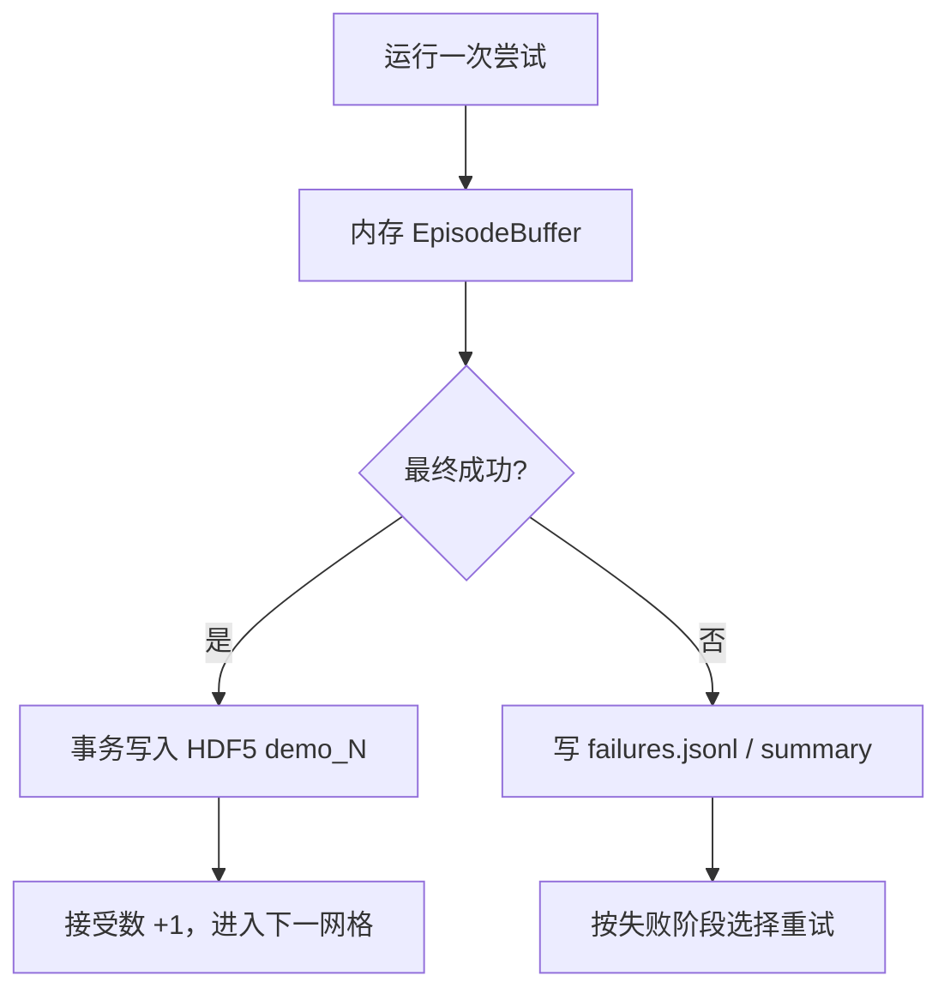

失败次数与目标 episode 数不同。例如目标 200 条表示 200 条接受成功的数据；中间可能有失败尝试。`--max-failed-attempts` 是防止系统性错误导致无限运行的安全上限，当前安全流水线默认值为 1000，而不是目标成功数。

### 2.2.5 失败日志应回答什么

失败记录包含时间、尝试编号、失败阶段、诊断原因、罐子位置、网格 cell、格内点尝试号等信息。它应支持以下查询：

- 失败集中在哪个阶段？
- 是否集中在某些网格或边界位置？
- 是 TCP 未到位、物体提前位移，还是抬升后物体未跟随？
- 同一精确点的重试是否都失败？
- 非抓取阶段是否出现新的系统性问题？

日志的价值是把“成功率低”转化成可统计的阶段和空间分布。

### 2.2.6 事务式 HDF5 写入

写 episode 时先创建 `_pending_demo_N`，完整写入字段后再原子移动为 `demo_N` 并 flush：

```python
pending = create_group(f"_pending_demo_{index}")
write_all_episode_arrays(pending)
validate_lengths()
move(pending, f"demo_{index}")
flush()
```

续采打开 HDF5 时会清理未完成的 `_pending_demo_*`，避免断电或中断留下半个 episode 被转换器误用。

### 2.2.7 断点续采

HDF5 根组额外保存 `collection_state`，包括：

- RNG 状态；
- 分层网格顺序、cursor 和 cycle；
- 当前随机场景；
- 抓取重试次数；
- 已跳过格子兼容字段。

续采还会比较任务、仿真时间步、记录间隔、随机化、相机和数据契约。若契约变化，会拒绝把不同分布的数据混入同一 HDF5。

> 警告：`--resume` 必须指定明确的 `--hdf5-file`。如果抓取几何、相机、随机范围或动作契约已经改变，应新建数据文件，而不是强行续采。

### 2.2.8 Headless 与资源开销

Headless 只隐藏 Isaac Sim 窗口，不关闭相机传感器。三路 680×480 RGB 仍要渲染并传回 CPU，因而采集仍占用：

- GPU：RTX 渲染、仿真和相机；
- 显存：场景、纹理、渲染目标和物理数据；
- CPU：仿真调度、HDF5 压缩和日志；
- 磁盘：三路图像与 episode 数据。

HDF5 图像使用 gzip level 4、shuffle 和逐帧 chunk。压缩节约空间，但会增加 CPU 开销。

### 2.2.9 当前采集命令

以下命令都应在项目根目录执行。

#### 小规模可视化采集并转换

```bash
bash run.sh collect-convert \
  --episodes 5 \
  --render \
  --random-seed 42 \
  --episode-timeout-s 300 \
  --reset-settle-s 2.0 \
  --record-every-n 6
```

适合检查相机、抓取路径和失败日志。若转换目标已经存在，应选择新的 `--repo-id`，不要随意覆盖正式数据。

#### 正式 Headless 采集并转换

```bash
bash run.sh collect-convert \
  --episodes 200 \
  --headless \
  --random-seed 42 \
  --episode-timeout-s 300 \
  --reset-settle-s 2.0 \
  --record-every-n 6 \
  --max-failed-attempts 1000 \
  --overwrite
```

`--overwrite` 在此用于允许重建转换后的 LeRobotDataset，不会让采集器静默覆盖一个明确的续采 HDF5。

#### 断点续采

```bash
bash run.sh collect-convert \
  --episodes 200 \
  --hdf5-file datasets/staging/<run>/drawer_insert_close_scripted.hdf5 \
  --resume \
  --headless \
  --record-every-n 6 \
  --overwrite
```

这里的 `--episodes 200` 表示 HDF5 最终总计达到 200 条成功 episode，不是再追加 200 条。

### 本节小结

采集器以 120 Hz 控制、20 Hz 同步记录三路图像、26D 状态和绝对动作。只有成功 episode 事务式写入 HDF5；失败进入独立日志。续采保存 RNG 和网格状态，并拒绝混合不兼容契约。

---

## 2.3 LeRobotDataset 转换与数据质量检查

### 本节目标

理解为什么需要将仿真 HDF5 转换为 LeRobotDataset、字段如何映射，以及训练前的安全检查能发现什么、不能发现什么。

### 2.3.1 为什么不直接用 HDF5 训练

HDF5 适合仿真端按 episode 原子写入，并保存工程诊断字段。LeRobotDataset 则提供统一的多模态 feature、Parquet 帧索引、任务表、视频、统计量和 episode-aware 采样接口。转换不会改变图像、状态或动作；语言属于显式迁移：旧 HDF5 的 20 段文本按配置映射为 10 个宏阶段，新 HDF5 则用稳定 ID 并交叉校验文本和专家阶段。

### 2.3.2 字段映射

| HDF5 | LeRobotDataset | 说明 |
|---|---|---|
| `processed_actions` | `action` | 26D 绝对关节目标 |
| `obs/s4_active_joint_pos` | `observation.state` | 26D 当前状态 |
| `obs/chest_front_rgb` | `observation.images.chest_front_rgb` | RGB 视频 |
| `obs/left_wrist_rgb` | `observation.images.left_wrist_rgb` | RGB 视频 |
| `obs/right_wrist_rgb` | `observation.images.right_wrist_rgb` | RGB 视频 |
| `obs/task_description` / `language_phase_id` | `task` / `task_index` | 规范化后的 12 阶段文本 |
| HDF5 demo | LeRobot episode | episode 边界 |

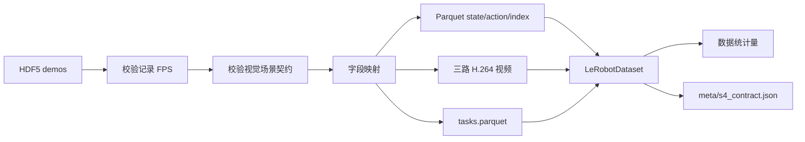

转换器逐帧调用 `dataset.add_frame(frame)`，每个 HDF5 demo 完成后调用 `save_episode()`。它读取已经记录的 RGB 数组并编码视频，不重新启动相机、仿真或渲染。

### 2.3.3 Episode、frame 与 timestamp

LeRobotDataset 用 `episode_index` 区分轨迹，用 `frame_index` 表示 episode 内帧号，并根据 20 Hz FPS 建立时间关系：

\[
t_i=\frac{i}{20}\ \mathrm{s}
\]

```text
episode 0: frame 0,1,2,...,T0-1
episode 1: frame 0,1,2,...,T1-1

global index: 0........T0-1 | T0........T0+T1-1
timestamp:    0,.05,.10,... | 0,.05,.10,...
```

episode 内 frame/timestamp 必须单调，不能因为合并文件而把两个 episode 拼成一条连续轨迹。

### 2.3.4 场景契约与可移植 metadata

转换前会比较不同 HDF5 文件的视觉场景契约，包括：

- 干扰物是否启用；
- 干扰物资产列表；
- 主抓取罐名义位置；
- 主罐 scale。

不一致时拒绝合并，避免同一个 dataset ID 内静默混入不同视觉任务定义。转换后写入 `meta/s4_contract.json`：

```json
{
  "schema_version": "s4_bimanual_v1",
  "action_semantics": "absolute_joint_target",
  "state_dim": 26,
  "action_dim": 26,
  "fps": 20,
  "camera_paths": ["obs/chest_front_rgb", "obs/left_wrist_rgb", "obs/right_wrist_rgb"]
}
```

片段省略了干扰物和主罐 metadata，但保留了核心契约。

### 2.3.5 数据统计量与 normalization

LeRobotDataset 统计 state/action 的 mean、std、min、max 等量。训练时 preprocessor 使用 mean/std：

\[
\hat{s}=(s-\mu_s)/(\sigma_s+\epsilon),\qquad
\hat{a}=(a-\mu_a)/(\sigma_a+\epsilon)
\]

Rollout 必须加载 checkpoint 对应的 processor 统计量。若用数据集 A 训练、却用数据集 B 的统计量反标准化，即使模型权重不变，实际关节目标也会失真。

### 2.3.6 四层数据质量检查

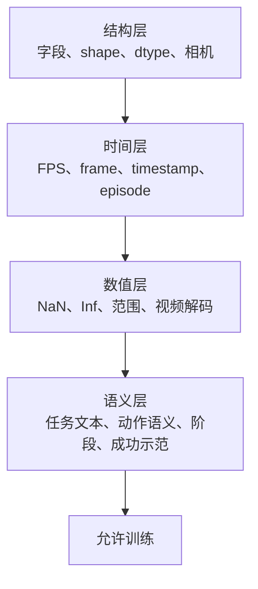

当前 `dataset-check` 自动验证：

- 26D state/action；
- 三路相机 key 和 shape；
- 20 Hz；
- Parquet frame/task 字段；
- episode 内 frame/timestamp 单调性；
- NaN/Inf；
- 视频存在并可解码首帧；
- HDF5 目标 episode 数与失败摘要；
- checkpoint input/output feature 与数据集匹配。

自动检查不能判断：

- 手指是否在罐体中部形成合理包裹；
- 轨迹是否有不必要绕行；
- 图像是否曝光过度或材质缺失；
- 失败尝试是否因成功条件过宽而被误接受。

因此还需要随机抽取 episode 可视化检查。

### 2.3.7 安全流水线

`collect-train` 使用 `set -Eeuo pipefail`、阶段状态、锁文件和错误 trap，按以下顺序执行：

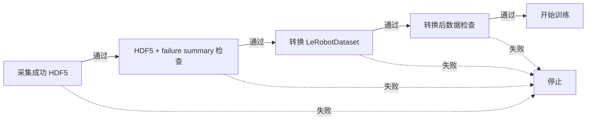

任何检查失败都不会启动后续训练。脚本还检查：转换目标、训练数据配置和训练输出目录是否一致；已有数据集或训练输出只有显式传入覆盖选项才处理。

### 2.3.8 当前转换和检查命令

#### 转换现有 HDF5

```bash
bash run.sh convert \
  --root-path datasets/staging/<run>/drawer_insert_close_scripted.hdf5
```

若目标数据集已存在，转换器默认拒绝覆盖。

> 警告：`--overwrite` 会删除并重建转换后的 LeRobotDataset 目录。它不会删除源 HDF5，但使用前仍应确认目标 dataset ID。

#### 检查 HDF5

```bash
bash run.sh dataset-check \
  datasets/staging/<run>/drawer_insert_close_scripted.hdf5 \
  --hdf5 \
  --expected-episodes 200
```

#### 检查转换后的数据集

```bash
bash run.sh dataset-check
```

#### 同时检查 checkpoint 契约

```bash
bash run.sh dataset-check \
  --checkpoint outputs/train/smolvla_drawer_insert_close_v4_12phase_serial_acquire/checkpoints/<step>/pretrained_model
```

#### 受保护的完整流水线

```bash
bash run.sh collect-train \
  --episodes 200 \
  --headless \
  --overwrite-dataset \
  --overwrite-training-output
```

这条命令会采集、检查、转换、再次检查，然后训练。若已有后台训练，不应并行执行。

### 2.3.9 `--overwrite` 的不同作用域

| 选项 | 作用对象 |
|---|---|
| `collect-convert --overwrite` | 允许重建转换后的数据集 |
| `convert --overwrite` | 删除并重建目标 LeRobotDataset |
| `collect-train --overwrite-dataset` | 显式允许覆盖转换目标 |
| `train --overwrite-output` | 删除已有训练输出后 fresh train |

这些选项不能互相替代，也不表示“覆盖所有数据”。尤其训练输出覆盖会删除 checkpoint，必须谨慎。

### 本节小结

转换把 HDF5 的成功 episode 映射成 LeRobotDataset 的 state、action、task、视频和 metadata，不会重新渲染。训练前应依次检查结构、时间、数值和语义；自动检查是必要条件，但不能替代轨迹和画面抽检。

---

## 2.4 SmolVLA 训练与离线评估

### 本节目标

理解当前 LeRobotDataset 如何形成 SmolVLA 训练批次、Flow Matching 损失如何优化，以及如何在不运行闭环仿真的情况下检查 checkpoint 和动作预测。

### 2.4.1 训练数据流

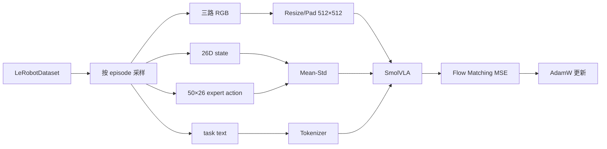

LeRobot 根据 `action_delta_indices=range(chunk_size)` 为每个观测取未来 50 帧动作。接近 episode 末尾时，不存在的未来动作使用 padding，并通过 `action_is_pad` 在损失中屏蔽。

### 2.4.2 当前训练配置

当前 `drawer_insert_close.smolvla.yaml` 定义：

| 参数 | 当前值 | 技术含义 |
|---|---:|---|
| `steps` | 500000 | 目标总优化步数 |
| `batch_size` | 16 | 每步训练样本数 |
| `num_workers` | 30 | 数据加载进程数 |
| `device` | `cuda` | 训练设备 |
| `seed` | 42 | 训练随机种子 |
| `save_freq` | 50000 | checkpoint 间隔 |
| `chunk_size` | 50 | 监督和预测动作长度 |
| `n_obs_steps` | 1 | 每个样本使用一个当前观测时刻 |
| `max_state_dim` | 50 | 状态 padding 上限 |
| `max_action_dim` | 32 | 动作 padding 上限 |
| `resize_imgs_with_padding` | `[512,512]` | 模型图像输入尺寸 |
| `freeze_vision_encoder` | true | 冻结视觉编码器 |
| `train_expert_only` | true | 主要训练动作专家 |
| `train_state_proj` | true | 训练状态投影 |
| `load_vlm_weights` | true | 加载 VLM 权重 |
| `optimizer_lr` | `1e-5` | AdamW 学习率 |
| `optimizer_weight_decay` | `1e-4` | 权重衰减 |
| `optimizer_grad_clip_norm` | 10 | 梯度裁剪 |

训练脚本还显式设置：

```text
policy.n_action_steps = chunk_size = 50
dataset.video_backend = pyav
env_eval_freq = 0
push_to_hub = false
persistent_workers = false
```

`num_steps=10` 没有写在项目训练 YAML 中，当前训练会继承本地 LeRobot `SmolVLAConfig` 的默认 Flow Matching 解码步数 10。应将其写成“当前本地实现默认值”，而不是项目显式覆盖值。

### 2.4.3 图像、语言、状态和动作预处理

#### 图像

三路 680×480 RGB 保持宽高比缩放并 padding 到 512×512，再由视觉编码器变成图像 token。padding 避免直接拉伸改变物体形状。

#### 语言

processor 确保 task text 末尾有换行，并使用 VLM tokenizer 编码。当前 tokenizer 最大长度默认 48。语言不是展示 metadata，而是真正参与策略条件。

#### 状态和动作

26D state padding 到 `max_state_dim=50`，26D action padding 到 `max_action_dim=32`。模型预测后只保留真实动作维度。

```text
state:  [真实 26D | padding 24D] -> State Projection
action: [真实 26D | padding  6D] -> Action Expert
输出:   [32D] -> 去 padding -> 26D
```

### 2.4.4 训练哪些参数

当前配置冻结视觉编码器，并设置 `train_expert_only=true`、`train_state_proj=true`。从工程角度看，它把训练重点放在：

- 将本机器人 state 映射到模型 token 空间；
- 学习当前任务的连续动作速度场；
- 保留预训练视觉语言表示。

这有助于降低显存和小数据集过拟合风险，但也限制了视觉编码器对特殊仿真材质和相机视角的适配能力。是否解冻视觉编码器需要实验比较，本文不把某个选择写成普遍最优。

### 2.4.5 Fresh training 与 Resume

Fresh training 从当前配置构建新策略和优化器。Resume 不只是加载 `model.safetensors`，还需要训练配置、优化器/调度器状态和训练步数。

当前训练脚本要求：

```text
<output_dir>/checkpoints/last/
├── pretrained_model/train_config.json
└── training_state/training_step.json
```

若缺少完整状态，脚本拒绝续训。`--steps` 在 resume 时表示新的目标总步数，并且必须大于已保存 step。

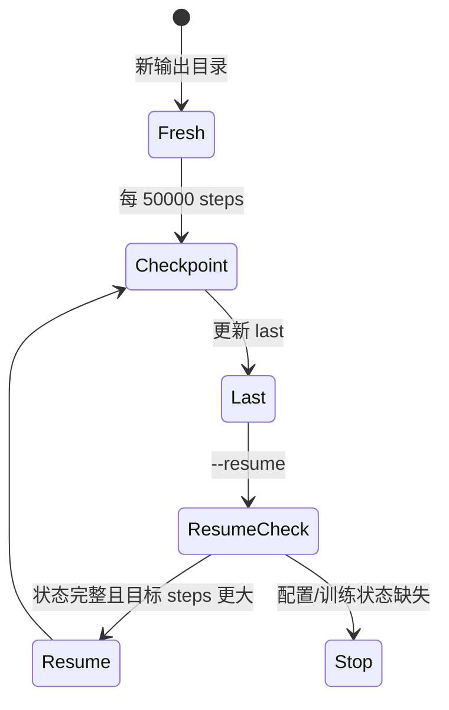

> 警告：`--overwrite-output` 会删除整个已有训练输出目录。它不能与 `--resume` 同时使用。

### 2.4.6 当前训练命令

#### 使用当前默认配置开始训练

```bash
bash run.sh train
```

#### 显式覆盖常用参数

```bash
bash run.sh train \
  --steps 500000 \
  --batch-size 16 \
  --save-freq 50000
```

#### 从完整 last checkpoint 续训

```bash
bash run.sh train \
  --resume \
  --steps 600000
```

`steps=600000` 是总目标步数，不是额外训练 600000 步。

### 2.4.7 训练 loss 能说明什么

Flow Matching loss 衡量模型预测速度场与目标速度的差异。下降说明模型更好地拟合训练动作分布，但不能直接说明：

- 三路图像 feature 是否在 Rollout 中正确传入；
- 反标准化是否使用了同一数据统计量；
- 预测动作在闭环中是否稳定；
- 灵巧手是否形成正确接触；
- 任务最终是否成功。

训练 loss 是模型优化指标，不是机器人任务成功率。

### 2.4.8 离线评估

当前 `preview` 从 LeRobotDataset 读取真实 state、task text 和 checkpoint 声明的第一路视觉 feature，经过训练保存的 preprocessor、policy 和 postprocessor，预测 action 并与 expert action 比较。它目前没有像训练和在线 Rollout 那样同时传入三路图像，因此属于轻量接口检查，而不是完整的多相机离线等价评估；若要比较三路视觉条件下的离线性能，应先补齐 `scripts/preview_policy.py` 的多相机输入。

常用误差：

\[
\mathrm{MAE}=\frac{1}{TD}\sum_{t,d}|a_{t,d}^{pred}-a_{t,d}^{expert}|
\]

\[
\mathrm{RMSE}=\sqrt{\frac{1}{TD}\sum_{t,d}(a_{t,d}^{pred}-a_{t,d}^{expert})^2}
\]

应分组查看 LA、LH、RA、RH，避免 14 个机械臂维度的均值掩盖 12 个灵巧手维度的接触误差。

| 指标 | 能发现 | 不能证明 |
|---|---|---|
| 总体 MAE/RMSE | 明显动作尺度或 feature 错误 | 闭环任务成功 |
| 每维误差 | 特定关节建模不足 | 物理接触正确 |
| 阶段误差 | 哪个任务阶段更难 | 模型能从偏离状态恢复 |
| Chunk 误差 | 未来动作一致性 | 动作融合后仍正确 |

#### 离线评估命令

```bash
bash run.sh preview \
  --checkpoint outputs/train/smolvla_drawer_insert_close_v4_12phase_serial_acquire/checkpoints/<step>/pretrained_model \
  --num-frames 20 \
  --device cuda
```

这属于 teacher-forced 评估：每次输入来自专家数据，而不是模型上一步动作造成的新状态。因此低误差不能覆盖闭环分布偏移。

### 2.4.9 训练前后检查矩阵

| 阶段 | 必查项目 | 失败时不要做什么 |
|---|---|---|
| 训练前 | dataset feature/FPS/video/stats | 不要直接训练 |
| 训练中 | loss、吞吐、checkpoint 完整性 | 不要只看单个低 loss |
| 训练后 | checkpoint feature 与 dataset | 不要直接启动长 Rollout |
| 离线评估 | 分组误差、阶段误差 | 不要宣称闭环成功 |
| 在线评估 | complete、success、视频、动作日志 | 不要只看最终一个布尔值 |

### 本节小结

当前训练使用三路图像、语言、26D 状态和未来 50×26 动作，通过 Flow Matching 优化动作专家。Fresh 与 resume 的状态语义不同。离线评估能检查 feature、normalization 和动作拟合，但不能替代闭环 Rollout。

---

## 2.5 在线 Rollout、成功率诊断与完整闭环

### 本节目标

理解训练后 checkpoint 如何驱动 IsaacLab 机器人，Action Chunk 如何被重规划和融合，以及如何从数据、模型、控制和物理四层系统定位失败。

### 2.5.1 在线闭环

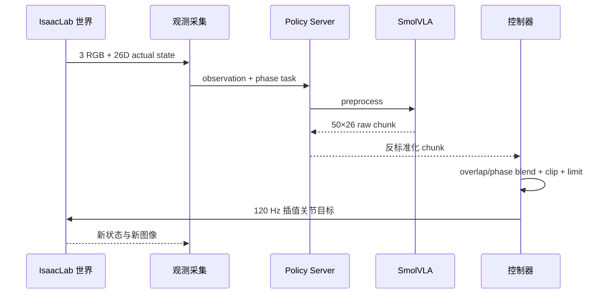

每个 episode 开始时 Policy Server `reset()`，清空模型动作队列。服务端还从转换后数据集的 `tasks.parquet` 和 frame Parquet 恢复最常见的 12 阶段语言顺序，并用匹配 episode 的中位阶段长度建立 Rollout schedule；`meta/s4_contract.json` 把 prompt 恢复为稳定 `language_phase_id`，同时携带活动 action group 和门控超时策略。它不是在 Rollout 时直接读取 26 个专家阶段的时长。

### 2.5.2 当前 Rollout 参数

| 参数 | 当前默认值 | 作用 |
|---|---:|---|
| `chunk_size` | 50 | 模型预测动作长度 |
| `chunk_replan_frames` | 40 | 每 40 个策略帧预测新 chunk |
| `chunk_overlap_blend_frames` | 5 | 新旧随机 chunk 交叉淡入 |
| `phase_transition_blend_frames` | 8 | 阶段任务文本切换时融合 |
| `phase_max_extension_frames` | 20 | 普通宏阶段门控不满足时最多延长 |
| `drawer_phase_max_extension_frames` | 80 | 接近把手和拉抽屉宏阶段最多延长 |
| `action_clip` | dataset min/max | 限制超出训练动作范围 |
| `max_joint_step` | 0.050 rad/策略帧 | 机械臂目标变化限制 |
| `hand_max_joint_step` | 0.015 rad/策略帧 | 灵巧手目标变化限制 |
| 策略频率 | 20 Hz | 与数据集一致 |
| 物理频率 | 120 Hz | 每策略帧 6 个物理步 |
| 重力补偿 | 开启，scale 1.0 | 补偿手臂重力 |
| seed | 42 | 可复现实验 |

注意源码在应用步长限制时按策略 interval 换算允许变化量；表中的命令行值是每策略帧基准，不应误解为每个 120 Hz 物理步都允许同样跳变。

### 2.5.3 Chunk 重规划与融合

模型每次生成 50 帧，但默认执行到第 40 帧时重新观测并生成新 chunk。重叠区对新旧动作交叉融合，阶段切换还额外平滑任务文本改变造成的动作跳变。

```text
policy frame  0                         39 40   44 45 49
Chunk A       [===============================]
Chunk B                                      [===============================]
融合区                                        <---5 frames--->

阶段切换     old task |<------8-frame transition------>| new task
```

重规划较快提高响应性，但增加推理次数和随机 chunk 之间的不连续；重规划较慢减少计算，却让机器人在环境变化后继续执行旧预测。当前 40 帧是工程默认，不是 SmolVLA 理论规定的唯一值。

### 2.5.4 20 Hz 动作到 120 Hz 控制

相邻策略 endpoint (a_k,a_{k+1}) 之间使用 6 个物理步线性插值：

\[
q_{k,j}^{cmd}=a_k+\frac{j}{6}(a_{k+1}-a_k),\qquad j=1,\ldots,6
\]

插值使 20 Hz 动作在 120 Hz 控制中连续，但无法修复语义错误。若动作块把右手移向错误一侧，插值只会让错误动作更平滑。

### 2.5.5 Raw、Fused、Masked、Command 与 Actual

诊断 CSV 对每个 20 Hz 策略帧保存五层信号：

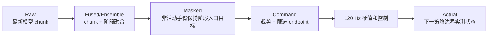

| 差值 | 主要解释 |
|---|---|
| Raw 相邻跳变大 | 模型或随机 chunk 不连续 |
| Raw 大、Fused 小 | temporal fusion 发挥作用 |
| Fused 与 Masked 差大 | 阶段单臂约束正在抑制非活动手臂输出 |
| Masked 与 Command 差大 | 裁剪或步长限制强烈介入 |
| Command 与 Actual 差大 | 执行器、碰撞、关节限制、重力或 mimic 跟踪问题 |

Actual 已按“当前 command 对下一 policy boundary 的实际状态”对齐，不能与旧版同帧 tracking 指标直接比较。

### 2.5.6 阶段状态门控

Rollout 的 12 阶段 schedule 来源于数据时长，但开启 `phase-state-gating` 后，阶段边界不是完全按时间盲切。每个语言阶段通过稳定 ID 选择末端专家门控，并携带活动 action group、超时策略和扩展类型。系统检查活动臂跟踪、手指状态、Home、抽屉开度，以及配置存在时的罐子边界、速度和位移。当前关键阶段门控耗尽扩展预算会终止本轮并记录失败原因，不会强制进入后续阶段；标记为 `drawer` 的阶段最多延长 80 帧，其余阶段默认延长 20 帧。

这是一种介于纯时间播放和完整任务状态机之间的机制：

- 纯时间播放简单，但手指未闭合也会抬升；
- 完整专家状态机依赖物体真值，弱化了 VLA 闭环评估；
- 当前轻量门控保护明显的执行延迟，同时仍让模型决定动作。

### 2.5.7 `complete` 与 `success`

- `complete=True`：数据集派生的阶段计划执行完成；
- `success=True`：最终仿真状态满足当前 success 条件。

可能出现：流程走完但罐子没有进入正确高度，因此 `complete=True, success=False`。反之，若任务状态偶然满足成功条件但 schedule 未完成，也不应把它当作稳定策略。

随机成功率为：

\[
\mathrm{SuccessRate}=\frac{N_{success}}{N_{episodes}}
\]

评估报告还应同时保留随机种子、checkpoint、随机范围、干扰物状态、每轮视频和失败分布。

### 2.5.8 当前 Rollout 命令

#### 确定性固定场景回归

```bash
bash run.sh rollout \
  --headless \
  --deterministic \
  --checkpoint outputs/train/smolvla_drawer_insert_close_v4_12phase_serial_acquire/checkpoints/<step>/pretrained_model \
  --policy-device cuda
```

`--deterministic` 展开为固定 seed 42 并关闭任务随机化，适合接口回归，不代表随机区域成功率。

#### 随机 20 轮成功率

```bash
bash run.sh rollout \
  --headless \
  --success-rate 20 \
  --checkpoint outputs/train/smolvla_drawer_insert_close_v4_12phase_serial_acquire/checkpoints/<step>/pretrained_model \
  --policy-device cuda
```

随机评估遵循 scripted YAML 的 `enabled` 开关与数据集 `s4_contract.json`：当前默认
启用主罐 5×5 分层格内随机，不生成干扰物；抽屉始终从完全关闭状态开始。多轮共用同一 RNG 流。

#### 诊断动作日志

```bash
bash run.sh diagnose \
  outputs/eval/<rollout_run>/ep001_actions.csv
```

每次 Rollout 默认创建独立目录，包含视频、动作 CSV、动作图和 `summary.json`。

### 2.5.9 四层诊断顺序

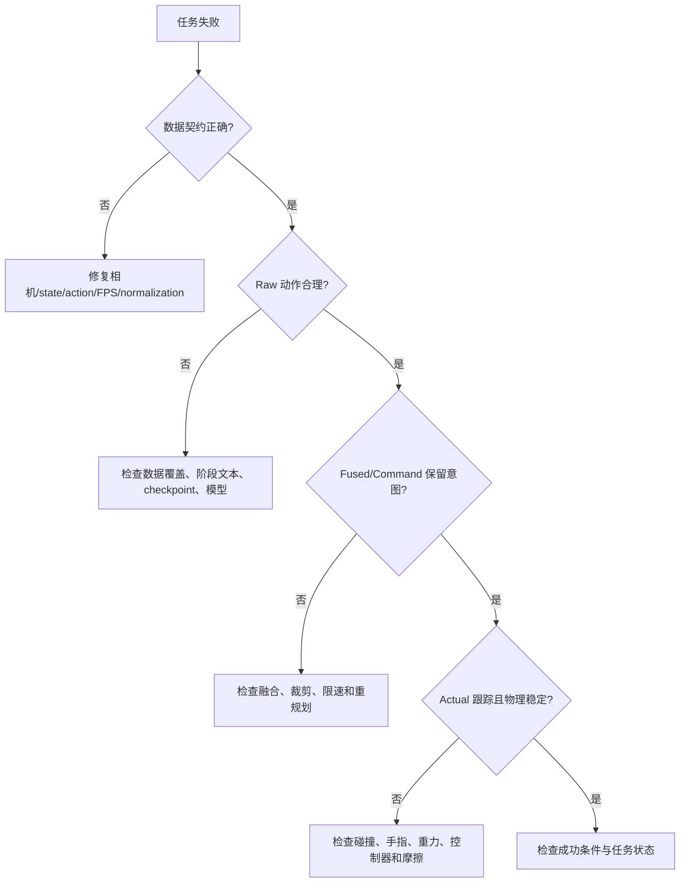

建议顺序是：先契约，再 Raw，再 Fused/Command，最后 Actual 和视频。不要一开始就调整 stiffness/damping，因为那可能掩盖模型动作或任务几何问题。

### 2.5.10 常见失败案例

#### 案例一：预抓取路径碰倒罐子

**现象** → 右手尚未闭合，罐子已偏离初始位置。

**证据** → 失败阶段为 `right_pregrasp_can` 或 `right_grasp_can`；物体位移门控超过 20 mm；视频显示张开手指扫过罐子。

**可能原因** → 预抓取点离罐子太近、路径方向不安全、手指开度不足或实际跟踪偏离。

**排查顺序** → 罐子初始位置 → pregrasp TCP/Actual → 视频中的指尖路径 → IK 分支 → 重力和 tracking。

**修复方向** → 调整预抓取相对偏移和进入方向，而不是优先放宽位移阈值。

**验证方法** → 在随机区域各边界做可视化采集，确认闭手前物体位移低于门控。

#### 案例二：TCP 到位但手没有包裹罐子

**现象** → 位置门控通过，闭手后罐子没有跟随抬升。

**证据** → `right_grasp_can` 完成，但 `right_lift_can` 的物体 Z 门控失败。

**可能原因** → TCP 不是指尖；抓取相对位置、高度或姿态不合适；拇指和四指未形成对向接触。

**排查顺序** → 右腕视频 → 手掌相对罐体中部 → 各手指 actual → 接触和摩擦 → 抬升 tracking。

**修复方向** → 优先调整抓取几何，不把 28 mm TCP 容差缩小为假精度。

**验证方法** → 闭手保持时罐子稳定、抬升后 Z 进入 `[1.20,1.35] m`。

#### 案例三：手指未闭合就抬升

**现象** → 手臂上移时手指仍在闭合，罐子滑落或被推倒。

**证据** → LH/RH actual 落后 command；阶段切换发生在闭合进度不足时。

**可能原因** → 阶段持续时间不足、状态门控失效、手部 tracking 慢或接触阻挡。

**排查顺序** → phase task → hand command → hand actual → close progress → arm command。

**修复方向** → 保持“闭合完成后手臂再动”的状态门控。

**验证方法** → 闭合和抬升之间存在稳定保持区间，实际手指曲线先收敛。

#### 案例四：抓住后滑落

**现象** → 罐子先随手抬起，随后在移动或放置中掉落。

**证据** → 抬升初始成功，但物体速度/位置随后异常；手部 actual 与 command 差异扩大。

**可能原因** → 接触面不足、摩擦不足、移动加速度过大、动作块跳变或手指命令被融合放松。

**排查顺序** → 物体轨迹 → RH actual → Raw/Fused 手部动作 → 机械臂速度 → 摩擦。

**修复方向** → 保持抓握、平滑机械臂轨迹，只有证据指向材质时才调摩擦。

**验证方法** → 从抬升到放置前物体相对手掌位姿稳定。

#### 案例五：松手后过早退出

**现象** → 罐子刚释放就被张开的手指或撤离路径带出抽屉。

**证据** → `right_open_hand` 后物体速度仍高，或退出阶段物体离开边界。

**可能原因** → 未等待稳定、横向退出过早、手指 actual 尚未张开。

**排查顺序** → release hand actual → 物体速度 → 1.5 秒保持 → lift-clear → retreat-clear。

**修复方向** → 松手完成后先垂直向上，再向外退出。

**验证方法** → 物体速度小于 0.05 m/s 后才开始退出。

#### 案例六：左手回 Home 路径异常

**现象** → 关闭抽屉后肘部前顶、腕部绕大弯或挂住把手。

**证据** → 左臂 Actual 路径在 release 与 Home 之间出现大角度跳变。

**可能原因** → Cartesian IK 切换分支或直接 Home 缺少安全过渡。

**排查顺序** → 把手接触 → 左手 actual → 关节过渡目标 → Home tracking。

**修复方向** → 使用当前显式关节过渡，保持肘部后收、手腕向后上方退出。

**验证方法** → TCP 单调远离把手、关节无突变、最终 Home 满足容差。

#### 案例七：专家成功但模型 Rollout 很差

**现象** → 脚本采集成功率高，训练 loss 和离线 MAE 也可接受，但在线失败。

**证据** → Raw 动作在阶段边界跳变，或模型稍微偏离专家轨迹后无法恢复。

**可能原因** → 数据覆盖不足、成功轨迹过于单一、语言阶段不一致、重规划过慢、processor/相机契约错误或接触阶段误差被总体指标掩盖。

**排查顺序** → dataset/checkpoint contract → 离线分阶段误差 → Raw → Fused → Command → Actual → 视频。

**修复方向** → 根据证据补充覆盖或调整时序控制，不直接用更多训练步数代替诊断。

**验证方法** → 固定场景回归后，再用相同 seed 和随机范围做多轮成功率比较。

### 2.5.11 故障矩阵

| 现象 | 数据层 | 模型层 | 控制层 | 物理层 |
|---|---|---|---|---|
| 图像目标错误 | 相机 key/顺序 | 视觉适配 | — | 材质/光照 |
| 关节整体偏移 | normalization | 输出尺度 | action semantics | 关节限位 |
| Chunk 边界跳变 | 阶段样本不足 | 随机预测 | overlap blend | — |
| Command 正确、Actual 落后 | — | — | 限速/增益/重力 | 碰撞/接触 |
| 抓取不稳 | 抓取覆盖 | 手部动作 | 时序/跟踪 | 几何/摩擦 |
| 放置后失败 | 放置数据 | 阶段预测 | 退出顺序 | 物体弹跳 |

### 2.5.12 从诊断回到数据闭环

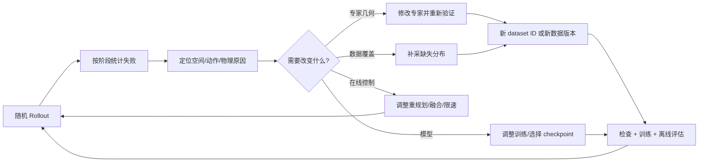

若修改了相机、动作语义、随机场景契约或专家抓取几何，不应把新旧 episode 静默混合。需要明确数据版本并重新生成统计量。

### 2.5.13 完整技术链路总结

本项目的闭环可以归纳为：

1. 用任务配置定义视觉、状态、动作和成功条件；
2. 用 Anchor、IK、关节过渡和物理门控构造专家；
3. 用分层格内随机覆盖主罐连续区域；
4. 只把成功轨迹同步写入事务式 HDF5；
5. 转换为带三路视频、任务、统计量和契约的 LeRobotDataset；
6. 在训练前检查结构、时间、数值和语义；
7. 用 Flow Matching 训练 SmolVLA 动作专家；
8. 用离线评估检查 feature 和动作拟合；
9. 通过 Policy Server 在双环境之间执行 Action Chunk；
10. 结合重规划、融合、限幅和 120 Hz 插值形成闭环；
11. 从 Raw、Fused、Command、Actual 和任务状态定位失败；
12. 将修复反馈到专家、数据、模型或控制层。

未来可以扩展到多任务、更丰富语言、多种物体、更复杂双臂协作、在线纠错和 Sim-to-Real。扩展前仍应保持同一原则：先定义可验证的契约，再扩大数据和模型规模。

### 本节小结

在线成功率不是单一模型指标，而是数据质量、模型生成、时序融合、控制跟踪和物理接触共同作用的结果。系统诊断应从契约到 Raw、Fused、Command、Actual，最后到物理状态，形成可复现的闭环实验。

---

**继续阅读：**[第三章：项目环境与完整部署](03_PROJECT_DEPLOYMENT.md)
