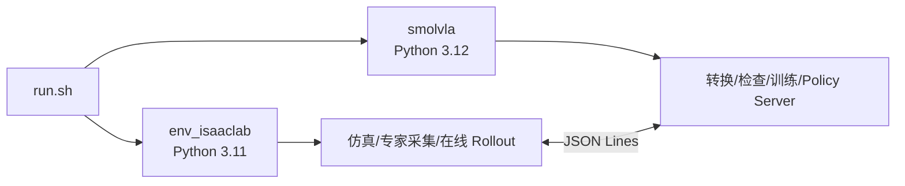
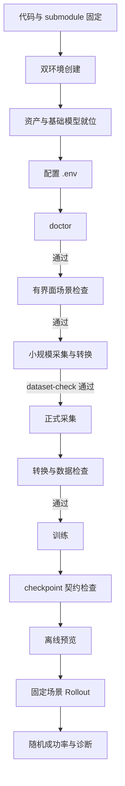

# 6.3 项目环境与完整部署

::: info 本节要点
本章讲的是"迁移"与"复现"：如何把当前项目搬上另一台工作站或 NVIDIA 训练服务器，一路上从仿真、数据采集、训练到在线 Rollout，都立起一条可复现的运行环境。仓库同时提供双 Conda 工作站路径和完整 Docker release 路径；操作系统级 NVIDIA driver 与 Container Toolkit 属于宿主，不进入应用镜像。固定下载来源、校验清单和更多宿主兼容矩阵，仍待后续补齐。
:::

> 部署原则：代码、外部仓库、场景资产、基础模型、数据集和训练输出是六类不同对象。它们必须分别锁定版本和位置，不能把“代码 clone 成功”理解为“项目已经可以运行”。

---

## 6.3.1 部署对象与目录边界

推荐的工作区结构如下。目录名可以改变，但 `.env` 必须指向实际位置。

```text
workspace/
├── smolVLA/                         # 顶层 Git 仓库
│   ├── s4_smolvla_isaaclab/         # 本项目主要代码
│   │   ├── assets/                   # 项目自有的小型机器人资产，进入 Git
│   │   ├── local_assets/             # 单独分发的 Isaac 场景资产，不进入 Git
│   │   ├── datasets/                 # HDF5 与 LeRobotDataset，不进入 Git
│   │   ├── models/                   # 基础模型，不进入 Git
│   │   └── outputs/                  # checkpoint、视频和诊断，不进入 Git
│   └── lerobot/                      # 固定版本的 LeRobot submodule
└── IsaacLab/                         # 外部 IsaacLab checkout
```

| 对象 | 是否随主 Git 仓库提交 | 当前定位方式 | 版本/完整性依据 |
|---|---:|---|---|
| `s4_smolvla_isaaclab/` | 是 | 顶层仓库内目录 | 主仓库 commit |
| `lerobot/` | 以 submodule 指针提交 | `.gitmodules`、`LEROBOT_ROOT` | submodule commit |
| 外部 IsaacLab | 否 | `ISAACLAB_ROOT` | IsaacLab commit 与安装版本 |
| `assets/` | 是 | 项目相对路径 | 主仓库 commit |
| `local_assets/` | 否 | 默认项目相对路径或 `S4_SCENE_ASSET_ROOT` | `manifest.json` |
| 基础模型 | 否 | `SMOLVLA_MODEL_ROOT` | 模型目录与模型配置 |
| 数据和输出 | 否 | `S4_DATA_ROOT`、`S4_OUTPUT_ROOT` | dataset contract、checkpoint config |

## 6.3.2 当前已验证软件基线

`environment/versions.md` 记录了当前已知可工作的工作站快照：

| 组件 | 已验证版本或修订 |
|---|---|
| Ubuntu | 22.04.5 LTS |
| NVIDIA driver | 580.159.03（最近成功日志记录） |
| PyTorch CUDA | 12.8 |
| Isaac Sim | 5.1.0.0 |
| IsaacLab | 0.54.2，Git `37ddf626...` |
| LeRobot | 0.6.1，Git `3f2179f3...` |
| `env_isaaclab` Python | 3.11.15 |
| `smolvla` Python | 3.12.13 |

Docker `full-v4-r1` 另在 Ubuntu 22.04、driver 570.190、8×RTX 4090 服务器完成 CUDA、EGL Vulkan、Isaac Camera、真实 Rollout、单卡 resume 与双卡 DDP 实测；容器内补丁版本为 Python 3.11.16/3.12.14。它与上表工作站快照是两条可审计记录。

完整包快照见 `environment/versions.md`。可在目标机器安装完成后运行以下脚本收集实际版本：

```bash
bash environment/collect_versions.sh
```

该命令只打印版本信息，不替代安装验证。目标机器的驱动与 CUDA 兼容性仍应按照 Isaac Sim 5.1 和 PyTorch 官方要求确认。

## 6.3.3 获取代码与固定外部仓库

### 6.3.3.1 克隆主仓库和 LeRobot

顶层仓库把 `lerobot/` 作为 submodule 管理。新机器应递归克隆：

```bash
git clone --recurse-submodules <project-url> smolVLA
cd smolVLA
git submodule status
```

如果主仓库已经 clone，但 `lerobot/` 为空或 GitHub 页面不能展开，应在顶层仓库执行：

```bash
git submodule update --init --recursive
```

随后进入主项目：

```bash
cd s4_smolvla_isaaclab
```

不要在未经验证的情况下把 LeRobot submodule 更新到最新主分支。SmolVLA 的配置字段、processor、dataset API 和 checkpoint 格式都可能随 LeRobot 版本变化。

### 6.3.3.2 准备外部 IsaacLab

IsaacLab 不嵌入本项目。应按 NVIDIA 官方流程获取与 Isaac Sim 5.1 匹配的 checkout，并记录 commit。当前项目通过 `ISAACLAB_ROOT/isaaclab.sh` 启动 IsaacLab。

> 待后续完善：发布时应给出外部 IsaacLab 的固定获取地址、精确 tag/commit 和 Isaac Sim 安装渠道。目前仓库只记录了已验证快照，不能替代 NVIDIA 官方安装说明。

## 6.3.4 创建双 Python 环境

项目故意使用两个环境，因为 Isaac Sim/IsaacLab 和当前 LeRobot/SmolVLA 的 Python 与依赖边界不同。



### 6.3.4.1 IsaacLab 环境

在 `s4_smolvla_isaaclab/` 下执行：

```bash
conda env create -f environment/isaaclab.yml
conda activate env_isaaclab

cd "$ISAACLAB_ROOT"
./isaaclab.sh --install none
```

当前环境文件固定的核心依赖包括 Python 3.11、NumPy 1.26、h5py 3.16、OpenCV 4.11、Pinocchio 2.7 和 Pink 3.1。Isaac Sim 与 IsaacLab 本体仍由外部安装提供。

### 6.3.4.2 SmolVLA 环境

```bash
cd /path/to/smolVLA/s4_smolvla_isaaclab
conda env create -f environment/smolvla.yml
conda activate smolvla
pip install -e "$LEROBOT_ROOT"
```

当前环境文件固定 Python 3.12、PyTorch 2.7、torchvision 0.22、PyAV 15.1、Transformers 5.5、PyArrow、pandas、FFmpeg 等依赖。`pip install -e` 使训练和 Policy Server 使用工作区内固定的 LeRobot 源码。

> 不要在两个环境中分别随意升级 `torch`、`transformers`、`av` 或 `lerobot`。即使安装成功，也可能破坏模型加载、视频编码或 processor 契约。

## 6.3.5 准备场景资产

### 6.3.5.1 使用维护者分发的资产包

将资产包解压到项目内，使目录满足：

```text
local_assets/isaac/5.1/
├── Isaac/Environments/...
├── Isaac/Props/...
└── manifest.json
```

至少应包含仓库场景、Sektion 抽屉、YCB 物体、IsaacLab 调试标记和相关 MDL/贴图依赖。`local_assets/` 被 Git 忽略，应由维护者通过云盘或其他大文件渠道单独分发。

### 6.3.5.2 从完整 Isaac 资产库制作最小资产包

若维护者本机已有完整 Isaac 5.1 资产库，可执行：

```bash
ISAAC_ASSET_ROOT=/path/to/Assets/Isaac/5.1 \
  bash run.sh prepare-assets --verify
```

`scripts/prepare_local_assets.py` 会：

- 从当前入口 USD 计算依赖闭包；
- 补充 USD 解析器无法发现的 MDL 导入和贴图；
- 收集 `frame_prim.usd`、坐标轴等调试资产；
- 保持原 Isaac 目录结构；
- 生成包含文件大小和 SHA-256 的 `manifest.json`。

资产不完整时常见现象是背景材质变红、环境变黑、纹理缺失或调试坐标系 USD 找不到。此时应先修复资产闭包，不能用修改灯光掩盖材质加载错误。

> 当前行为：程序不会自动联网下载场景资产。自动下载地址、权限、断点续传和校验策略属于后续部署优化项。

## 6.3.6 准备 SmolVLA 基础模型

当前训练配置使用本地 `SmolVLM2-500M-Video-Instruct`。模型目录由 `SMOLVLA_MODEL_ROOT` 定位，训练 YAML 再拼接具体模型子目录。

部署前应确认：

- 模型配置和权重文件完整；
- 目标路径与 `configs/tasks/drawer_insert_close.smolvla.yaml` 一致；
- 模型来源和 revision 已记录；
- 训练节点能够离线读取，不依赖运行时静默下载。

> 待后续完善：仓库目前没有面向新用户的基础模型自动下载命令、固定 revision 清单和校验文件。发布部署包时应补充官方模型来源、下载方式、许可证提示和 SHA-256/Hub revision。

## 6.3.7 配置 `.env`

从模板创建本机配置：

```bash
cp .env.example .env
```

示例：

```dotenv
S4_PROJECT_ROOT=/path/to/smolVLA/s4_smolvla_isaaclab
ISAACLAB_ROOT=/path/to/IsaacLab
ISAAC_ASSET_ROOT=/path/to/isaacsim_assets/Assets/Isaac/5.1
S4_SCENE_ASSET_ROOT=/path/to/smolVLA/s4_smolvla_isaaclab/local_assets/isaac/5.1
LEROBOT_ROOT=/path/to/smolVLA/lerobot
SMOLVLA_MODEL_ROOT=/path/to/smolVLA/s4_smolvla_isaaclab/models
S4_DATA_ROOT=/path/to/smolVLA/s4_smolvla_isaaclab/datasets
S4_OUTPUT_ROOT=/path/to/smolVLA/s4_smolvla_isaaclab/outputs
S4_CACHE_ROOT=/path/to/smolVLA/s4_smolvla_isaaclab/.cache
S4_ISAACLAB_ENV=env_isaaclab
S4_SMOLVLA_ENV=smolvla
```

| 变量 | 作用 | 是否可迁移到其他磁盘 |
|---|---|---:|
| `S4_PROJECT_ROOT` | 主项目根目录 | 否，必须指向当前项目 |
| `ISAACLAB_ROOT` | 外部 IsaacLab checkout | 是 |
| `ISAAC_ASSET_ROOT` | 制作资产包时使用的完整 Isaac 资产库 | 是 |
| `S4_SCENE_ASSET_ROOT` | 运行时场景资产根目录 | 是；默认项目内 `local_assets` |
| `LEROBOT_ROOT` | 固定 LeRobot checkout | 是 |
| `SMOLVLA_MODEL_ROOT` | 基础模型根目录 | 是 |
| `S4_DATA_ROOT` | HDF5 与 LeRobotDataset 根目录 | 是 |
| `S4_OUTPUT_ROOT` | checkpoint、评估和诊断输出 | 是 |
| `S4_CACHE_ROOT` | 本地缓存 | 是 |

`.env` 是本机配置，不应提交到 Git。提交的 JSON/YAML 应使用环境变量或项目相对路径，不能写入个人绝对路径。

## 6.3.8 配置来源与优先级

| 内容 | 唯一来源 |
|---|---|
| 活跃任务 | `.local/active_task` 或 `S4_TASK` |
| 数据/schema/场景 | `configs/tasks/<task>.dataset.json` |
| 专家轨迹/随机化/成功条件 | `configs/tasks/<task>.scripted.yaml` |
| 训练超参数/输出 | `configs/tasks/<task>.smolvla.yaml` |
| 关节顺序/手部 mimic 映射 | `s4_robot/s4_robot_cfg.py`、`s4_robot/control_mapping.py` |
| 单次运行覆盖 | 当前 CLI 参数 |

部署时不要复制一份“当前配置”到其他目录再手工维护。`run.sh`、采集、转换、训练和 Rollout 都应读取相同的 active task 配置。

## 6.3.9 分阶段部署验收

### 6.3.9.1 静态入口检查

```bash
bash run.sh help
bash run.sh list-tasks
bash run.sh activate-task drawer_insert_close
```

### 6.3.9.2 环境与路径检查

首次部署、尚无数据和 checkpoint 时运行：

```bash
bash run.sh doctor
```

`doctor` 会检查外部仓库、场景资产、隐式渲染资产、模型目录、两个环境 imports，以及 26D、三相机和 20/120 Hz 契约。

`doctor --strict` 还要求已生成的数据集和约定 checkpoint，因此应放在完整产物存在之后执行，不宜作为空工作区的第一条命令。

Docker 路径先在宿主执行（以下命令从顶层 `smolVLA/` 目录运行）：

```bash
bash docker/host_preflight.sh --gpu 0
export S4_IMAGE=s4-smolvla:full-v4-r1
bash docker/run.sh --gpus 0 verify
```

`verify-train` 检查固定训练依赖、完整数据集与所选 GPU；显式选择多张物理卡时还会实际启动对应数量的 Accelerate rank。`verify-rollout` 检查 EGL Vulkan、checkpoint processor、Isaac renderer 和真实 RGB frame。GPU 在创建容器时确定，宿主物理 `4,5` 会在容器内重编号为 `0,1`。

### 6.3.9.3 场景验收

```bash
bash run.sh sim
```

有界面检查：

- 仓库背景材质不是红色错误材质；
- 环境、机器人和桌面曝光合理；
- 两个抽屉、主罐和机器人位置正确；
- 三路相机和腕部视锥方向正确；
- TCP、抽屉把手坐标系和关节初态合理。

### 6.3.9.4 小规模数据链路验收

```bash
bash run.sh record \
  --output datasets/staging/s4_drawer_insert_close_v4_12phase_serial_acquire/deployment_smoke_2.hdf5 \
  --episodes 2 \
  --random-seed 42 \
  --episode-timeout-s 300 \
  --record-every-n 6

bash run.sh dataset-check \
  datasets/staging/s4_drawer_insert_close_v4_12phase_serial_acquire/deployment_smoke_2.hdf5 \
  --hdf5 \
  --expected-episodes 2
```

这一步会实际启动仿真并写入数据，只应在环境验收后执行。使用独立 smoke 文件可避免覆盖正式 HDF5 或 LeRobotDataset；应同时查看失败日志和专家动作质量。

### 6.3.9.5 正式采集、转换与检查

```bash
bash run.sh collect-convert \
  --episodes 200 \
  --random-seed 42 \
  --episode-timeout-s 300 \
  --reset-settle-s 2.0 \
  --record-every-n 6 \
  --max-failed-attempts 20 \
  --hdf5-file datasets/staging/s4_drawer_insert_close_v4_12phase_serial_acquire/production_200_seed42/drawer_insert_close_scripted.hdf5 \
  --headless
```

`--episodes 200` 表示目标成功 episode 总数，不是总尝试数。首次生成目标 LeRobotDataset 时不要传 `--overwrite`；只有明确替换已有转换结果时才使用它。需要保留现有 HDF5 并继续采集时，保持同一 `--hdf5-file` 并增加 `--resume`。完整、安全的分步命令见 `docs/PIPELINE.md`。

### 6.3.9.6 训练与 checkpoint 检查

```bash
bash run.sh train
```

该命令只适用于配置中 `output_dir` 尚不存在的 fresh run；已有发布 checkpoint 时会被安全拒绝。新实验要复制 `.smolvla.yaml` 并修改 `output_dir`，当前 CLI 没有 `--output-dir` 覆盖参数。

继续完整 checkpoint：

```bash
bash run.sh train --resume
```

训练完成或中途评估前，使用 checkpoint 契约检查：

```bash
bash run.sh dataset-check \
  --checkpoint outputs/train/<run>/checkpoints/<step>/pretrained_model
```

### 6.3.9.7 离线检查与在线 Rollout

```bash
PYTHONPATH="$PWD" bash run.sh preview \
  --checkpoint outputs/train/<run>/checkpoints/<step>/pretrained_model \
  --num-frames 20 \
  --device cuda
```

当前 `preview` 只传入 checkpoint 声明的第一路视觉 feature，适合作为轻量接口和动作误差检查，不等价于三相机在线输入。
命令必须从项目根目录运行；当前 preview 脚本不会自行把项目根目录加入 Python 搜索路径，
所以需要保留 `PYTHONPATH="$PWD"`。

固定场景回归：

```bash
bash run.sh rollout \
  --headless \
  --deterministic \
  --checkpoint outputs/train/<run>/checkpoints/<step>/pretrained_model \
  --policy-device cuda
```

随机化 20 轮成功率：

```bash
bash run.sh rollout \
  --headless \
  --success-rate 20 \
  --checkpoint outputs/train/<run>/checkpoints/<step>/pretrained_model \
  --policy-device cuda
```

动作诊断：

```bash
bash run.sh diagnose outputs/eval/<run_dir>/ep001_actions.csv
```

## 6.3.10 标准运行顺序与安全门



任何阶段失败都应在当前层停止：

- 资产或材质错误时不采集；
- HDF5 或视频检查失败时不训练；
- dataset/checkpoint feature 不匹配时不 Rollout；
- 固定场景不能回归时，不直接扩大随机评估规模。

## 6.3.11 生成物、磁盘与备份

| 目录 | 内容 | 建议策略 |
|---|---|---|
| `datasets/staging/` | 原始 HDF5 和失败日志 | 采集后立即备份；转换前保留原件 |
| `datasets/lerobot_data/` | LeRobotDataset、视频和 metadata | 与 HDF5 的 contract 一起保存 |
| `models/` | 外部基础模型 | 记录来源、revision 和校验值 |
| `outputs/train/` | checkpoint 和训练状态 | 保留完整 `last` 与关键步数 |
| `outputs/eval/` | Rollout 视频、CSV、PNG、summary | 与 checkpoint、seed、配置一起归档 |
| `.cache/` | 本机缓存 | 可重新生成，不作为唯一副本 |

这些目录默认不进入 Git。迁移工作站时，应分别传输代码、资产、基础模型、数据集和 checkpoint，不能只复制一个仓库目录就假定所有产物齐全。

## 6.3.12 常见部署故障

| 现象 | 优先检查 | 不应首先修改 |
|---|---|---|
| `lerobot/` 无内容 | 是否递归 clone、submodule commit | 不要把目录直接复制成普通文件夹 |
| MDL 报错、背景红色 | `local_assets` 的 MDL 和贴图闭包、manifest | 不要先改灯光 |
| `frame_prim.usd` 缺失 | UIElements 是否被资产包收集 | 不要删除全部可视化逻辑 |
| 环境很暗但无材质错误 | 固定灯光和 authored light 设置 | 不要把曝光无限调高 |
| `import isaaclab` 失败 | `env_isaaclab`、IsaacLab 安装和路径 | 不要在 `smolvla` 环境启动仿真 |
| checkpoint 无法加载 | LeRobot commit、processor、配置和完整目录 | 不要只复制权重文件 |
| 视频转换失败 | `smolvla` 环境的 PyAV/codec/FFmpeg | 不要重新渲染 HDF5 图像 |
| Rollout 相机契约失败 | checkpoint image keys 与任务配置 | 不要交换左右腕图像 |
| 动作尺度异常 | normalization、action semantics、26D 顺序 | 不要用 stiffness/damping 掩盖 |

## 6.3.13 部署验收清单

- [ ] 主仓库和 LeRobot submodule 位于预期 commit；
- [ ] 外部 IsaacLab commit 和 Isaac Sim 版本已记录；
- [ ] `env_isaaclab` 与 `smolvla` 均可导入所需包；
- [ ] `.env` 不包含维护者机器遗留路径；
- [ ] `local_assets/isaac/5.1/manifest.json` 存在且资产完整；
- [ ] SmolVLM2 基础模型目录完整；
- [ ] `bash run.sh doctor` 通过；
- [ ] 场景材质、光照、机器人、抽屉和相机显示正常；
- [ ] 小规模成功 episode 能写入 HDF5；
- [ ] LeRobotDataset 视频、FPS、state/action 和 task metadata 通过检查；
- [ ] checkpoint 与数据集 feature 兼容；
- [ ] 固定场景 Rollout 输出视频、动作日志和 summary；
- [ ] 随机成功率实验记录 checkpoint、seed、范围和配置版本；
- [ ] 数据、模型和输出已有独立备份策略。

## 6.3.14 后续部署优化框架

以下框架区分已经落地的能力和仍待完善的交付项：

### P0：可复现性

1. 固定并公开主仓库、LeRobot、IsaacLab 和基础模型 revision；
2. 为场景资产包和基础模型提供机器可读校验清单；
3. 记录 GPU、驱动、CUDA、Python 和关键包的兼容矩阵；
4. 明确 `.env` 中每个变量的必填、默认和示例值。

### P1：安装自动化

1. `docker/host_preflight.sh` 已提供只读宿主检查；后续补充更多驱动/GPU 兼容矩阵；
2. 增加基础模型和资产包的显式下载命令；
3. 下载后执行 revision/SHA-256 校验，失败时停止；
4. 将环境创建、editable LeRobot 安装和版本采集合并为可审计步骤；
5. 对网络下载、磁盘空间不足和权限错误提供清晰提示。

### P2：交付与运行维护

1. 生成包含 commit、环境版本、任务配置和 checkpoint 的运行清单；
2. 给数据集、checkpoint 和 Rollout 结果定义统一归档命名；
3. `s4-verify-runtime --profile train|rollout|full` 已提供最小与完整验收；后续增加正式训练 startup 的自动限步 profile；
4. 增加部署升级指南，说明哪些变化需要重采、重训或只需重跑 Rollout；
5. 在不静默修改用户环境的前提下支持自动恢复缺失的非敏感依赖。

> 设计边界：自动化部署应“显式下载、明确版本、校验后使用、失败即停止”。不应在启动仿真时后台静默获取资产或模型。

## 6.3.15 本章小结

完整部署，从来不只是"把 Python 包装上"那么轻巧——它要让代码、两个运行环境、外部仓库、场景资产、基础模型、数据契约与 checkpoint 同时咬合对齐。当前项目已经具备环境 YAML、统一 `run.sh`、`.env`、完整 Docker release、宿主 preflight、分 profile runtime verify、资产归纳、`doctor` 与数据检查；后续重点是完善固定下载来源、更多宿主兼容矩阵和发布自动化。

部署验收通过后，应回到[6.2](02-implementation.md)，依"专家数据 → 转换检查 → 训练 → 固定 Rollout → 随机成功率"的顺序，把完整闭环再走一遍。
