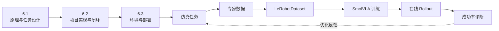

---
prev:
  text: '5.3 视觉抓取与放置'
  link: '/05-vision-control/03-visual-pick-place'
next:
  text: '5.1 SmolVLA 原理与任务设计'
  link: '/06-smolVLA/01-principles'
---
# SmolVLA 高级技术教程：从 IsaacLab 仿真数据到 VLA 闭环控制

> 文档状态：本页是课程总索引。原单文件教程已按“原理 → 实现 → 部署”拆分为三个递进章节；工程事实以当前代码和配置为准。

:::: info 本章导读
这是菜单上的**第一道招牌菜——佛跳墙**。

为什么是佛跳墙？只因它**复杂、慢炖、食材丰富**：把图像、语言、关节状态、动作历史悉数倒进同一只"智能料理机"，小火慢炖出一锅端到端 VLA——不讲究哪一味料单管什么用，只要配方齐、火候到，"出来就是好的"。这道菜，你且不必时时盯着锅里的翻涌，只管把食材备齐、把锅坐稳，它自会替你一气呵成。

以双臂灵巧手任务 drawer_insert_close 为贯穿案例，本章讲解如何把 Isaac Sim / IsaacLab 里的机器人操作任务，转化为可供 VLA 模型学习的多模态时序数据——脚本化专家控制、HDF5 采集、LeRobotDataset 转换、SmolVLA 训练、离线评估与在线闭环 Rollout，全链路一一打通。三条主线贯穿始终：**原理线**（模型为何这般设计）、**实现线**（任务→专家→数据→模型，怎样靠稳定的契约牢牢咬合成一环）、**部署线**（双环境、资产、配置，如何做到可复现）。当前项目只研究仿真 VLA，不展开仿真与真机联合数据训练。仓库另有独立的无 Isaac 真机 Quest/Pink 遥操链路，操作与安全说明见 `hardware_teleop/README.md`；不要把它与本课程的 Isaac Rollout 控制进程混为一体。
::::

## 适用读者与前置知识

本文面向已经掌握以下内容的读者：

- 机器人关节、连杆、自由度和执行器；
- 正运动学、逆运动学和坐标变换；
- 机械臂与灵巧手的基础控制；
- Python、Linux、Conda 和深度学习训练的基本使用。

教程仅在 TCP、IK、关节目标、重力补偿与执行器跟踪处做必要的衔接，不重新推导基础机器人学。

## 学习目标

完成三章后，读者应能够：

- 解释 VLA 和 SmolVLA 的输入、输出、Action Chunk 与 Flow Matching；
- 说明 Isaac Sim、IsaacLab、LeRobot 和 SmolVLA 的职责边界；
- 设计一个可采集、可学习、可自动评估的仿真操作任务；
- 理解脚本专家、随机化和数据质量之间的关系；
- 理解 HDF5 与 LeRobotDataset 的字段映射；
- 检查训练、离线评估和在线 Rollout 的接口是否一致；
- 在另一台工作站上配置项目路径、环境、资产和模型；
- 根据动作日志、任务阶段和物理状态定位成功率问题。

## 三章目录

| 顺序 | 章节 | 核心问题 | 建议读者 |
|---|---|---|---|
| 1 | [6.1 SmolVLA 原理与任务设计](01-principles.md) | SmolVLA 为什么能从图像、语言和状态预测动作？什么样的仿真任务适合学习？ | 第一次接触 VLA 或需要理解系统设计者 |
| 2 | [6.2 项目实现与端到端闭环](02-implementation.md) | 当前项目怎样完成专家控制、采集、转换、训练和 Rollout？ | 准备读代码、采集数据或优化成功率者 |
| 3 | [6.3 项目环境与完整部署](03-deployment.md) | 如何准备仓库、双环境、资产、模型、数据目录并完成部署验收？ | 需要复现、迁移或交付项目者 |



## 推荐阅读路线

### 路线 A：系统学习

按 6.1、6.2、6.3 顺序阅读。该路线先建立模型与数据契约，再理解实现，最后部署。

### 路线 B：准备采集和训练

先阅读 6.2 中的“专家策略”“数据采集”“转换与检查”，再阅读 6.3 的环境验收和标准运行顺序；遇到 Action Chunk、Flow Matching 或归一化问题时回查 6.1。

### 路线 C：迁移到新工作站

先完成 6.3 的仓库、环境、资产和模型准备，再按部署验收顺序执行。环境通过后，阅读 6.2 确认当前数据和 checkpoint 契约。

### 路线 D：优化 Rollout 成功率

直接阅读 6.2 的在线 Rollout、Raw/Fused/Command/Actual 和失败诊断，再回到 6.1 理解“可达不等于可抓”以及随机化覆盖原则。

## 当前技术基线

| 组件 | 当前记录 | 证据来源 |
|---|---|---|
| Isaac Sim | 5.1.0.0 | `environment/versions.md` |
| IsaacLab | 0.54.2，外部 checkout | `environment/versions.md` |
| LeRobot | 0.6.1，外部 submodule/check-out | 本地 LeRobot 源码与 `environment/versions.md` |
| 仿真环境 | Python 3.11，环境名 `env_isaaclab` | `environment/isaaclab.yml`、`run.sh` |
| 模型环境 | Python 3.12，环境名 `smolvla` | `environment/smolvla.yml`、`run.sh` |
| VLM 基座 | `SmolVLM2-500M-Video-Instruct` 本地目录 | 当前任务训练配置 |
| 活跃案例 | `drawer_insert_close` | `configs/tasks/` |
| Docker release | `full-v4-r1` 已完成 8×RTX 4090 服务器全链路验证 | 顶层 `docker/README.md`、`environment/versions.md` |

> 版本说明：`environment/versions.md` 是已验证的工作站快照，不代表任意补丁版本都可以互换。部署时应如实记录实际 commit、Python、CUDA、驱动与包版本。

## 证据标记

三节统一使用以下表述区分证据强度：

- **当前代码/配置**：可由当前实现直接证明；
- **测试契约**：测试代码定义了预期行为，但不代表本次已经执行；
- **官方资料**：来自 SmolVLA 论文、Hugging Face/LeRobot 或 NVIDIA 官方资料；
- **历史结果**：README 或旧实验留下的结果，只说明当时条件；
- **尚未验证**：有设计或实现依据，但缺少当前版本实验结果。

> 技术要点：IK 可达，不等于物理抓取成功；离线误差低，不等于在线闭环顺利；而训练完成，更不等于数据、模型与 Rollout 之间的契约一定锲合。评估时，务必把这三层"不等于"记在心里。

## 当前接口速照

下表用于防止阅读历史日志或旧文档时混淆当前实现。具体解释见 6.1 和 6.2。

| 项目 | 当前实现 |
|---|---|
| 专家状态机 / 模型语言 | 27 个控制阶段 / 12 个语言宏阶段 |
| 主罐随机 | 默认启用，5×5 分层格内连续随机 |
| 抓取相关物体位移门控 | 20 mm |
| 同一位置重试 | 初始尝试之外额外重试 3 次 |
| 重试耗尽 | 留在同一格内重新采样，不跳过该格 |
| state/action | 26D，绝对关节目标 |
| 数据/控制频率 | 20 Hz / 120 Hz |
| Action Chunk | 50 个策略帧 |
| 在线重规划 | 默认每 30 个策略帧 |
| 训练保存频率 | 当前任务 YAML 默认 50000 steps |
| Headless | 隐藏 GUI，但三路相机仍需渲染 |
| 离线 preview | 当前只传入第一路视觉 feature |
| 最终成功条件 | 主罐根坐标位于宽松的抽屉世界坐标 X/Y/Z 区域内；抽屉开度仅作遥测 |

## 课程文件

```text
docs/course/
├── index.md                  # 本索引（课程定位、路线、技术基线）
├── 01-principles.md           # 原理、架构、任务设计
├── 02-implementation.md       # 专家、数据、训练、Rollout
└── 03-deployment.md           # 环境、资产、配置、部署验收
```

## 官方参考资料

1. Mustafa Shukor et al. [SmolVLA: A Vision-Language-Action Model for Affordable and Efficient Robotics](https://arxiv.org/abs/2506.01844), 2025.
2. Hugging Face LeRobot. [SmolVLA 官方文档](https://huggingface.co/docs/lerobot/smolvla).
3. Hugging Face LeRobot. [SmolVLA 官方实现](https://github.com/huggingface/lerobot/tree/main/src/lerobot/policies/smolvla).
4. Hugging Face LeRobot. [LeRobotDataset v3.0](https://huggingface.co/docs/lerobot/lerobot-dataset-v3).
5. NVIDIA. [Isaac Lab Documentation](https://isaac-sim.github.io/IsaacLab/).
6. NVIDIA. [Isaac Sim Documentation](https://docs.isaacsim.omniverse.nvidia.com/5.1.0/).

## 项目内部参考

- `README.md`、`run.sh`、`.env.example`：项目入口和路径配置；
- `configs/tasks/`：数据、专家和训练的真实配置；
- `docs/README.md`：精简后的工程文档索引；
- `docs/REPRODUCTION.md`：双环境、资产、模型与部署；
- `docs/PIPELINE.md`：采集、转换、训练、Rollout、契约与诊断。
