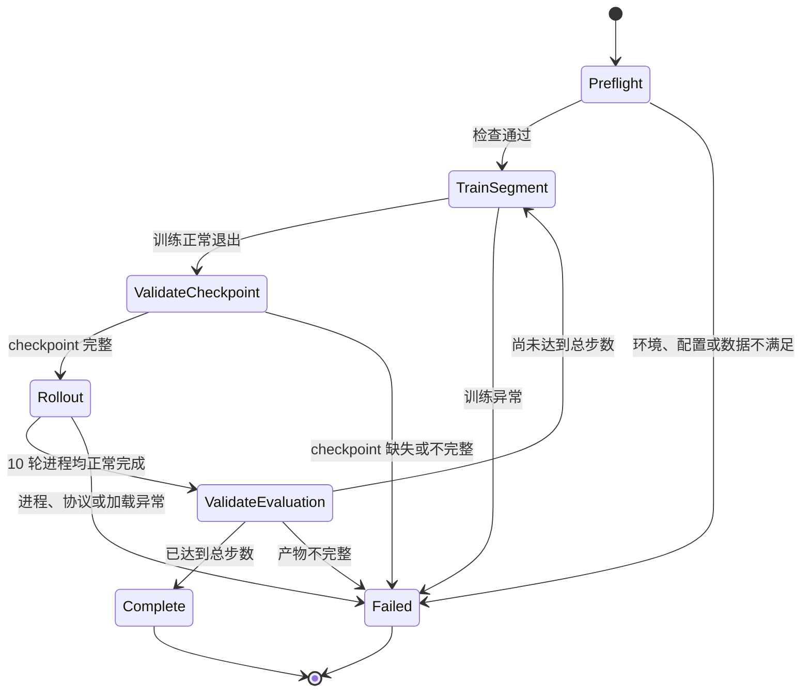

# 单任务清理与周期训练评估设计

日期：2026-08-22

## 1. 背景与目标

当前项目的主任务是 `drawer_insert_close`，完整链路已经覆盖专家数据采集、HDF5 转换、LeRobotDataset 检查、SmolVLA 训练、离线检查和在线 Rollout。仓库中仍保留早期“右手抓取蓝色圆柱并放到圆盘”的任务、兼容分支、文档、测试以及约 19.7 GB 的历史数据与训练输出。

本次改动有两个目标：

1. 删除早期圆柱任务及其历史产物，使主项目只保留 `drawer_insert_close`。
2. 新增 `bash run.sh train-eval` 接口，将训练拆分为若干安全段；每训练 50,000 步，正常结束训练进程并释放 GPU，随后在同一组 10 个随机场景上执行 Rollout，保存完整产物，再从完整 checkpoint 恢复训练。

本设计不修改 `/home/zfy/smolVLA/lerobot` 或外部 IsaacLab，不改变抽屉任务的专家抓取轨迹、模型结构、数据契约和现有 Rollout 时序参数。

## 2. 范围

### 2.1 包含

- 删除旧圆柱任务的实现、配置、注册、专用数据字段、转换兼容分支、文档和专用测试。
- 删除已经确认的旧任务 staging 数据、LeRobotDataset 和训练输出。
- 清理 `run.sh`、采集、转换、预览和可视化入口中的旧任务参数与默认值。
- 新增主项目级 `train-eval` 编排接口。
- 固化 10 个随机评估场景，并让所有 checkpoint 重放同一组场景。
- 保存每个评估节点的日志、视频、动作、诊断图和汇总结果。
- 对 checkpoint、Rollout 产物和中断恢复状态实施强校验。
- 增加轻量测试与 dry-run 验证，不在自动测试中启动 Isaac Sim、训练或加载 GPU checkpoint。

### 2.2 不包含

- 不修改 LeRobot 源码。
- 不修改外部 IsaacLab。
- 不重新采集或转换当前抽屉任务数据集。
- 不重新训练现有模型。
- 不改变 26D state/action 契约、绝对关节目标语义、三路相机或 20 Hz 数据频率。
- 不改变 Action Chunk 长度、40 帧重规划、重叠融合、阶段切换融合和动作限速参数。
- 不将专家使用的物体真实位姿、TCP 或接触状态变成 SmolVLA Rollout 的决策输入。
- 不自动启动消耗 GPU 的训练或随机 Rollout 验证。

## 3. 方案选择

### 3.1 采用：分段训练编排器

`train-eval` 每次仅训练到下一个目标节点，使 LeRobot 训练进程正常退出并生成完整 checkpoint；检查通过后启动独立 Policy Server 和 IsaacLab Rollout。评估完成并通过产物检查后，再从完整 checkpoint 恢复下一段训练。

优点：

- optimizer、scheduler、随机状态和训练步数通过标准 checkpoint 恢复；
- 训练与评估不会竞争 GPU；
- 任一节点可审计、可恢复；
- 无需侵入 LeRobot 训练循环。

### 3.2 不采用：暂停或强制终止持续训练进程

信号暂停不能可靠释放 GPU，强制终止可能留下不完整 checkpoint，也难以保证 optimizer 和 scheduler 状态的一致性。

### 3.3 不采用：修改 LeRobot 回调

这会扩大维护范围并违反“不修改 LeRobot 仓库”的约束。周期评估属于本项目的工作流职责，应由主项目编排。

## 4. `train-eval` 接口与状态机

保留现有纯训练入口：

```bash
bash run.sh train
```

新增入口：

```bash
bash run.sh train-eval
```

新入口复用当前任务 YAML、训练脚本和 Rollout 接口，并提供与工作流直接相关的参数，例如目标训练步数、评估间隔、每节点 Rollout 轮数、随机种子及 Rollout 时序覆盖参数。默认评估间隔为 50,000 步，每节点评估 10 轮。

工作流状态如下：



若总步数不是 50,000 的整数倍，最终剩余目标也必须保存并评估。例如总步数为 180,000 时，评估节点为 50,000、100,000、150,000 和 180,000。

## 5. 训练恢复语义

每个训练段必须正常结束，生成可恢复的完整 checkpoint。恢复内容至少包括：

- 模型权重；
- optimizer 状态；
- scheduler 状态；
- 当前训练步数；
- 随机状态；
- 训练配置和必要的 processor/config 文件。

编排器不得将仅有模型权重的目录认定为可恢复训练 checkpoint。它还必须验证 checkpoint 标识的步数等于当前目标节点。

现有 `bash run.sh train` 行为保持不变；只有 `train-eval` 执行分段训练和周期评估。

## 6. 固定随机场景清单

周期评估采用随机场景，但不同 checkpoint 必须重放完全相同的 10 个场景，而不能仅依赖相同随机种子。

第一次评估前生成：

```text
outputs/train/<run_name>/periodic_eval/scenario_manifest.json
```

每个场景至少记录：

- 场景序号；
- 主罐分层网格编号与精确坐标；
- 抽屉初始开度；
- 干扰物启用状态、资产和位姿；
- 随机种子；
- 当前任务 ID；
- dataset/scene contract 标识；
- 与场景生成有关的配置摘要或指纹。

抽屉初始开度与采集配置一致，在当前配置范围 `[0.00, 0.05] m` 内随机。所有评估节点读取同一清单。若任务配置、场景契约或随机化契约与清单不兼容，工作流停止，不能静默重新生成场景。

## 7. 评估执行与输出

每个 checkpoint 运行 10 个随机场景。任务本身失败是合法评估结果，只要 Rollout 进程正常结束且输出完整，就继续训练；进程崩溃、checkpoint 加载失败、协议错误或产物缺失属于工作流错误，必须停止。

建议输出结构：

```text
outputs/train/<run_name>/periodic_eval/
├── scenario_manifest.json
├── workflow_state.json
├── train_eval.log
├── step_050000/
│   ├── rollout.log
│   ├── summary.json
│   ├── summary.csv
│   ├── episode_000/
│   │   ├── video.mp4
│   │   ├── actions.csv
│   │   ├── diagnostics.json
│   │   └── diagnostic_plots/
│   └── ...
└── step_100000/
```

每个节点至少汇总：

- checkpoint 路径和训练步数；
- 场景清单标识；
- 实际执行 episode 数；
- 每轮 `complete` 与 `success`；
- 失败阶段与已知失败原因；
- 阶段完成率；
- 阶段强制切换次数；
- Raw、Fused、Command、Actual 动作诊断；
- 总成功率和总完成率；
- 视频、CSV、JSON 和诊断图路径。

## 8. 产物检查与失败策略

进入下一训练段前必须确认：

1. checkpoint 目录存在且文件完整；
2. checkpoint 步数与目标节点一致；
3. 10 个场景全部实际执行；
4. 汇总中的 episode 数严格等于 10；
5. 每轮均有结构化结果、动作记录、视频和诊断输出；
6. Policy Server、Isaac Sim 和协议层没有致命异常；
7. 汇总文件与各 episode 结果一致；
8. 工作流状态已经原子地更新为该节点完成。

以下情况立即停止工作流并返回非零状态：

- 训练进程异常退出；
- checkpoint 不完整或无法恢复；
- Policy Server 无法启动或加载模型；
- Rollout 进程崩溃或通信失败；
- 少运行一轮或出现重复场景编号；
- 关键输出缺失、为空或不可解析；
- 场景清单不兼容；
- 汇总统计与 episode 文件不一致。

某轮任务未成功、未抓稳罐子或未关闭抽屉不会中止工作流；它必须作为失败样本保留在评估结果中。

## 9. 中断恢复

`workflow_state.json` 至少记录：

- 工作流配置指纹；
- 总目标步数和评估间隔；
- 固定场景清单标识；
- 当前阶段；
- 已完成的训练节点；
- 已完成且校验通过的评估节点；
- 最近完整 checkpoint；
- 最近错误及时间。

恢复规则：

- 已完整评估且产物再次校验通过的节点不重复运行；
- 训练完成但评估未完成的节点重新执行整组 10 轮评估；
- 不完整的评估目录不能标记为完成，可以保留用于故障排查；
- 从最近完整 checkpoint 恢复训练；
- 工作流参数或契约指纹改变时拒绝直接续跑，防止混合两组实验。

状态文件采用临时文件加原子替换的方式更新，避免中断后留下看似有效的半写入状态。

## 10. 采集与 Rollout 对齐边界

### 10.1 必须保持一致

- 任务和场景资产；
- 三路相机名称、语义、分辨率和顺序；
- 26D state/action 顺序；
- 绝对关节目标动作语义；
- 20 Hz 策略/数据频率和 120 Hz 底层控制接口；
- 10 个宏观语言阶段及文本；
- reset 后的机器人、抽屉和物体初始分布；
- 主罐和干扰物随机范围；
- 抽屉初始开度随机范围；
- 重力补偿配置；
- 最终任务成功判据。

### 10.2 合理保留的差异

- 采集由约 20 个专家控制阶段执行，但写入 10 个宏观语言阶段；Rollout 使用数据集中的 10 个阶段调度。
- 采集使用 IK 和确定性关节目标；Rollout 使用模型预测的 50 帧 Action Chunk。
- 采集仅提交成功 episode，失败后重试；Rollout 保存每次评估结果，不能通过自动重试掩盖失败。
- 采集以 TCP、姿态、手指、物体和抽屉状态进行严格门控；Rollout 大致保留当前轻量门控和超时扩展机制。
- 采集失败后只有成功才推进分层网格；周期评估从固定清单逐项执行，不按成功与否改变清单。

### 10.3 特权状态只用于诊断

Rollout 可以记录物体真实位姿、TCP 误差、接触和阶段门控指标，用于定位失败，但不得利用这些信息自动修正模型动作、代替模型完成抓取或重试失败 episode。否则成功率无法代表 SmolVLA 的闭环能力。

## 11. 旧任务删除边界

删除对象包括：

- `tasks/right_blue_cylinder_plate.py`；
- `tasks/right_blue_cylinder_plate_controller.py`；
- `tasks/bimanual_red_blue_plate.py`；
- `configs/tasks/right_blue_cylinder_plate.dataset.json`；
- `configs/tasks/right_blue_cylinder_plate.smolvla.yaml`；
- `tasks/__init__.py` 中相应注册；
- `scripts/record_dataset.py` 中旧圆柱任务状态机、专用参数和辅助分支；
- 场景构造中红、蓝圆柱与圆盘专用逻辑；
- HDF5 中仅服务旧任务的红块、蓝块和圆盘位姿字段；
- 转换器中的 `right_only` 兼容契约和专用 action slice；
- 预览、可视化、手动控制与辅助脚本中的旧任务默认值或专用路径；
- 只描述或只验证旧任务的文档与测试。

删除以下历史产物：

```text
datasets/staging/s4_right_blue_cylinder_plate_v1
datasets/lerobot_data/s4_right_blue_cylinder_plate_v1
outputs/train/smolvla_s4_right_v1
```

执行删除前必须再次解析精确绝对路径，确认路径位于项目目录内且名称完全匹配，并报告大小。不得使用未解析环境变量、宽泛通配符或递归删除项目根目录。

## 12. 共享能力保留规则

以下内容即使历史上由旧任务引入，只要当前抽屉任务仍引用，就必须保留：

- 机器人与灵巧手加载；
- 三路相机；
- 灯光、材质和本地资产解析；
- 关节顺序与 26D 数据契约；
- 通用 IK、关节控制和重力补偿；
- 通用场景构造辅助函数；
- HDF5 writer 和 LeRobotDataset 转换基础设施；
- Policy Server、在线 Rollout 与诊断；
- 抽屉、主抓取罐和当前干扰物使用的资产。

清理依据必须是当前引用关系和抽屉任务契约，不得根据文件名或历史来源批量删除共享代码。

## 13. 验证策略

### 13.1 静态检查

- 全项目不再引用旧 task ID、dataset ID 和输出目录；
- 任务注册和可用配置只保留 `drawer_insert_close`；
- Shell 语法、Python 编译和模块导入正常；
- 文档命令只引用当前任务；
- 不存在删除模块后的失效引用；
- LeRobot 仓库无修改。

### 13.2 轻量自动测试

- 任务注册与配置加载；
- 26D state/action 和相机契约；
- HDF5 schema；
- 随机化和重试策略；
- Policy Server 协议与 Rollout metrics；
- 训练节点计算，包括非 50,000 整数倍终点；
- 固定场景清单的生成、复用和不兼容拒绝；
- checkpoint 完整性判断；
- Rollout 产物完整性判断；
- 工作流中断恢复和幂等行为；
- 任务失败与基础设施失败的分类。

### 13.3 集成验证

- `train-eval` dry-run 不启动训练、Isaac Sim 或 Policy Server；
- 使用测试夹具模拟完整和不完整 checkpoint；
- 使用测试夹具模拟成功、任务失败和进程失败的评估产物；
- 运行当前 drawer 数据集检查；
- 确认 `bash run.sh train` 行为未改变；
- 确认 `bash run.sh train-eval` 参数、节点计划、日志和输出路径正确。

真实分段训练和 10 轮 Isaac Sim 随机 Rollout 需要用户显式运行，不能在轻量验证阶段自动启动。

## 14. 完成标准

满足以下条件后才可认为实现完成：

1. 项目任务注册、配置、入口、文档和测试只保留 `drawer_insert_close`；
2. 指定的三个旧历史目录已按授权删除；
3. 抽屉任务的数据采集、转换、检查、训练和 Rollout 接口仍保持契约一致；
4. `bash run.sh train` 保持纯训练行为；
5. `bash run.sh train-eval` 能正确计算分段节点并通过 dry-run 验证；
6. 固定随机场景清单包含 10 个场景，抽屉开度按 `[0.00, 0.05] m` 随机且可复放；
7. 每个 checkpoint 的评估均产出完整日志、视频、动作、诊断和汇总；
8. 任务失败被计入成功率但不误判为工作流错误；
9. checkpoint、协议或产物错误会安全停止，且可从最近完整节点恢复；
10. 主项目相关轻量测试通过，LeRobot 仓库保持未修改；
11. 未擅自运行真实训练或 GPU Rollout。
