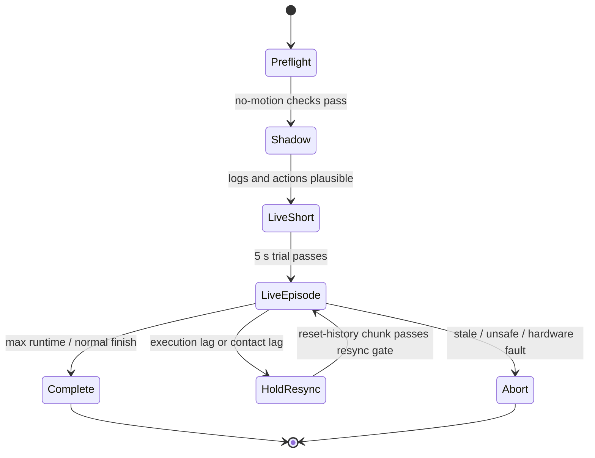
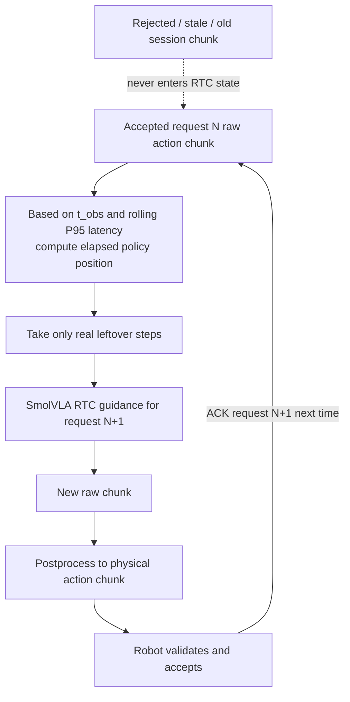
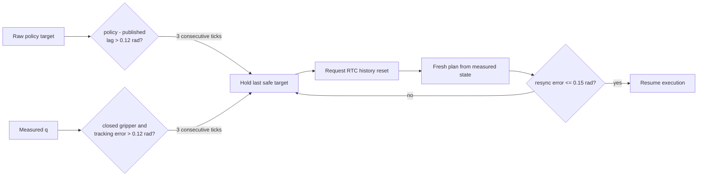
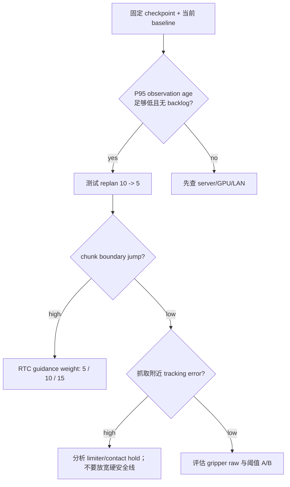

# S4 SmolVLA 真机 Rollout 链路与参数手册

本文描述当前已部署的真机推理链路。内容以以下配置为准：

- 推理主机配置：`config/hosts/train_host.yaml`
- 真机配置：`config/robots/s4_real.yaml`
- 协议版本：v4；服务器和真机必须使用同一版本的 `real_vla_stack`。

本文的目标是让一次 rollout 的每个输入、时间轴、保护层和日志字段都可追溯。训练、模型选择和数据集转换请参阅根目录 README 的 workflow。

## 1. 当前部署基线

| 项目 | 当前值 | 说明 |
| --- | ---: | --- |
| Policy | SmolVLA fine-tuned checkpoint | 显式 checkpoint，不允许 `latest` |
| State / action | 8D / 8D | 7 个手臂关节 + 1 个夹爪值 |
| Cameras | `head`, `wrist_right` | RGB、JPEG LAN 传输 |
| Policy timeline | 20 Hz | 1 step = 50 ms，必须匹配数据集 FPS |
| Robot control | 30 Hz | 1 tick ≈ 33.3 ms |
| Model chunk | 50 steps | 一次推理预测 2.5 s |
| Robot execute horizon | 35 steps | ActionBuffer 最多保留 1.75 s |
| Replan interval | 10 steps | 每 0.5 s 请求一次新计划 |
| RTC horizon | 10 steps | RTC 的执行/overlap 窗口为 0.5 s |
| Server endpoint | `192.168.110.87:5555` | ZeroMQ LAN policy server |

## 2. 系统架构

```mermaid
flowchart LR
    subgraph Robot[Robot 192.168.110.35]
        CAM[head + wrist_right cameras]
        STATE[Measured q7 + gripper state]
        OBS[Timestamped observation]
        BUF[ActionBuffer\n20 Hz observation-time sampling]
        FILTER[JointCommandFilter\nper-joint velocity + acceleration limits]
        BRIDGE[ROS/SDK bridge\n/lowcmd_replay + /handscmd]
        ARM[Real arm + drawer]
        CAM --> OBS
        STATE --> OBS
        BUF --> FILTER --> BRIDGE --> ARM
        ARM --> STATE
    end

    subgraph Host[Inference host 192.168.110.87]
        SERVER[Policy server]
        PRE[Preprocessor]
        MODEL[SmolVLA checkpoint]
        RTC[Server-side RTC state\nraw model-space chunk]
        SERVER --> PRE --> MODEL
        RTC --> MODEL
        MODEL --> RTC
    end

    OBS -->|JPEG + state + timestamps + RTC metadata| SERVER
    SERVER -->|postprocessed physical [T,8] action chunk| BUF
```

职责边界：

- 只有 robot process 可以向硬件发布命令；host 不导入 ROS，也不能控制机器人。
- Server 保存的是 **raw/model-space** action chunk，供下一次 RTC guidance 使用。
- Robot 收到的是 postprocessor 输出后的物理 8D 动作；robot 侧 radians、二值夹爪和 limiter 输出绝不能反传为 RTC history。
- `ActionBuffer` 负责按原始 observation timestamp 对 chunk 采样；它不把 response 到达时刻当作 chunk 的第零帧。

## 3. 单次 rollout 生命周期



推荐启动顺序：

1. 启动底层机器人 SDK 和状态反馈。
2. 在 host 上运行 `checkpoint-check`，再启动 policy server。
3. 在 robot 上运行 `--live --preflight-only`；此步骤不发布动作。
4. 运行 shadow rollout；不带 `--live` 时不会创建硬件命令 publisher。
5. 依次进行 5 s、10 s、完整 episode 的 live rollout。

正常结束可根据 `return_home_on_finish` 回 home；故障时默认 `return_home_on_abort: false`，只保持并释放控制权，避免故障路径再引入一次运动。

## 4. 一次 policy request 的数据与时间流程

```mermaid
sequenceDiagram
    participant R as Robot control loop
    participant C as AsyncPolicyClient
    participant S as Policy server
    participant M as SmolVLA + RTC

    R->>R: Capture cameras + measured state at t_obs
    R->>C: ObservationRequest(session, request, t_obs, state, JPEG, delay estimate)
    C->>S: ZeroMQ multipart request
    S->>M: Preprocess and predict action chunk
    M-->>S: raw chunk for RTC + physical chunk for robot
    S-->>C: ActionResponse
    C-->>R: response received at t_rx
    R->>R: age = t_rx - t_obs
    alt age <= max_response_age_ms and safety checks pass
        R->>R: Replace ActionBuffer using source time t_obs
        R->>S: Next request ACKs accepted request id
    else stale or unsafe
        R->>R: Discard response; preserve last safe plan / hold
    end
```

关键公式：

```text
observation_age_ms = (response_received_time - observation_capture_time)
rtc_delay_steps    = ceil(P95_recent(observation_age_ms) * policy_hz / 1000)
policy_position    = (now - observation_capture_time) * policy_hz
```

所以 response 晚到时，robot 会跳过已经过时的 action steps，而不是重新执行 `chunk[0]`。

## 5. 两条不同的时间轴

| 时间轴 | 频率 | 作用 |
| --- | ---: | --- |
| Policy timeline | 20 Hz | 数据集、模型 chunk、RTC delay、ActionBuffer 的动作语义 |
| Control timeline | 30 Hz | 真机命令发布、关节限速/限加速度、状态监控 |

机器人端对前 7 个关节在相邻 policy steps 之间线性插值；夹爪按离散 policy step 保持，不做连续插值。

当前时间关系：

```text
chunk_size = 50             50 / 20 = 2.50 s   模型预测范围
execute_horizon = 35        35 / 20 = 1.75 s   robot 缓冲范围
replan_interval_steps = 10  10 / 20 = 0.50 s   重规划间隔
RTC execution_horizon = 10  10 / 20 = 0.50 s   RTC 执行窗口
```

`chunk_size`、`execute_horizon`、`replan_interval_steps` 不是同一个概念：模型预测更远，robot 只缓存前段，并在旧轨迹耗尽前提前获取新观察对应的替代计划。

## 6. RTC：新旧 chunk 如何衔接



RTC 的要点：

- `prev_chunk_left_over` 是未执行的 raw model-space action，不是 robot 实际发布的关节目标。
- leftover 只传真实剩余长度；不人工 zero-pad，LeRobot 内部需要的 padding 由官方实现处理。
- Robot 只有在通过 safety check 后，才在下一请求中 ACK 该 chunk；被拒绝、过期或来自旧 session 的 chunk 永远不进入 RTC history。
- 延迟使用最近 `rtc_latency_window_size` 次端到端 observation age 的 P95，而不是 lifetime maximum。
- `chunk_blend_duration_ms: 0`：RTC 已负责 plan continuity，robot 不再叠加大范围 chunk blend。

## 7. 参数参考

### 7.1 Server 与模型参数

来源：`config/hosts/train_host.yaml`。

| 参数 | 当前值 | 作用 | 调整建议 |
| --- | ---: | --- | --- |
| `deployment.checkpoint` | explicit 300k checkpoint | live server 与 robot 必须一致的模型标识 | 每次实验显式固定；禁止 `latest` |
| `server.bind` / `port` | `0.0.0.0` / `5555` | policy server 网络监听 | 通常不调 |
| `server.device` | `cuda` | 推理设备 | CUDA 不可用时 fail closed，不回退 CPU |
| `image_transport` | `jpeg` | 图像网络编码 | 与 robot 协议保持一致 |
| `jpeg_quality` | 90 | 图像带宽与画质折中 | 网络紧张时可测 80/85；训练图像质量不应明显失配 |
| `rtc.enabled` | `true` | 启用官方 RTC | 对比实验才关闭 |
| `rtc.execution_horizon` | 10 | RTC overlap/execution 窗口，单位为 policy steps | 首选保持与 replan interval 相同 |
| `rtc.max_guidance_weight` | 10.0 | 对旧 chunk continuity 的 guidance 强度 | 可做 5 / 10 / 15 单变量 A/B |
| `model.chunk_size` | 50 | 模型单次动作预测长度 | pretrained architecture 参数，不应在部署时随意改 |

### 7.2 网络与 freshness 参数

来源：`config/robots/s4_real.yaml`。

| 参数 | 当前值 | 含义 | 触发后的行为 |
| --- | ---: | --- | --- |
| `connect_timeout_ms` | 1000 ms | 首条 chunk 可等待的上限 | 超时前未得到首 chunk 则 abort |
| `request_timeout_ms` | 1000 ms | 单次 RPC transport 等待上限 | 仅影响等待；不代表旧动作可执行 |
| `max_response_age_ms` | 500 ms | response 对应 observation 的最大年龄 | 超出即 `stale_rejected`，不写入 buffer |
| `max_motion_chunk_age_ms` | 1800 ms | 当前 accepted chunk 的最大推进年龄 | 停止沿旧轨迹前进，保持最后目标 |
| `max_chunk_age_ms` | 2400 ms | 等待恢复的最终上限 | 超出 abort 并 relinquish |
| `max_consecutive_timeouts` | 2 | 连续超时/过期上限 | 超过后 fail closed |
| `rtc_latency_window_size` | 30 | 延迟统计滚动窗口长度 | 30 次可避免单次尖峰永久影响后续 |
| `rtc_latency_percentile` | 95 | 统计分位点 | P95 是当前较保守的 RTC delay 估计 |

`request_timeout_ms` 可以大于 `max_response_age_ms`：前者表示“最多愿意等多久”，后者表示“收到后还能不能执行”。

### 7.3 Rollout 节奏与运行方式

| 参数 | 当前值 | 作用 | 注意事项 |
| --- | ---: | --- | --- |
| `mode` | `live` | 配置侧 live 开关 | CLI 仍必须额外传 `--live` |
| `control_hz` | 30 | 命令发布频率 | 不要单独改，限幅器 `dt` 依赖它 |
| `policy_hz` | 20 | 模型/数据集动作频率 | 必须匹配 dataset FPS 和 response policy FPS |
| `execute_horizon` | 35 | ActionBuffer 缓存前 35 steps | 必须不大于模型 chunk size |
| `replan_interval_steps` | 10 | 新观察的请求间隔 | 最优先可调闭环参数 |
| `camera_warmup_s` | 2.0 s | 首请求前相机稳定时间 | 太短会造成首帧曝光/白平衡漂移 |
| `start_from_home` | `true` | live 前执行 home | home 后才执行新的 policy chunk |
| `return_home_on_finish` | `true` | 正常结束后回 home | 只对正常完成有效 |
| `return_home_on_abort` | `false` | 故障后是否回 home | 保持 `false`，故障时避免二次运动 |
| `max_episode_s` | 30 s | 默认完整 episode 时长 | 5 s/10 s 试验用 CLI 覆盖 |

### 7.4 Policy chunk 安全检查

| 参数 | 当前值 | 检查对象 | 建议 |
| --- | ---: | --- | --- |
| `reject_non_finite` | `true` | NaN / Inf | 始终保持开启 |
| `max_policy_target_jump_rad` | 0.20 rad | chunk 相邻目标跳变 | 硬安全边界，不为成功率放宽 |
| `max_policy_tracking_error_rad` | 0.25 rad | response 首目标相对 request observation 的误差 | 防止明显离当前状态过远的 chunk |
| `resync_target_error_rad` | 0.15 rad | RTC reset 后首个可恢复 chunk | 比普通 gate 更严格 |
| `max_consecutive_policy_rejections` | 2 | 连续 unsafe chunk 上限 | 超过后 abort；单次异常先丢弃并重试 |

### 7.5 真实执行、接触与同步保护



| 参数 | 当前值 | 意义 |
| --- | ---: | --- |
| `max_command_tracking_error_rad` | 0.18 rad | 已发布限幅命令与实测关节的硬停止线 |
| `rtc_reset_policy_lag_rad` | 0.12 rad | policy 被 limiter 拉开时的软重同步阈值 |
| `contact_tracking_error_rad` | 0.12 rad | 夹爪已闭合时，识别抽屉/接触约束造成卡滞的阈值 |
| `execution_sync_trigger_cycles` | 3 | 连续约 100 ms 超阈值才 hold，避免单点噪声 |
| `resync_target_error_rad` | 0.15 rad | 新计划在恢复前必须接近实测状态 |

这不是力控：它是 position-control 环境下的安全恢复机制。抽屉卡住或不允许上下运动时，系统选择保持并从实测状态重规划，而不是调高增益或继续积累关节误差。

### 7.6 每关节 limiter

| 参数 | 当前值 | 单位 | 来源 |
| --- | --- | --- | --- |
| `max_rollout_joint_velocity_rad_s` | `[0.77, 0.50, 0.77, 0.91, 0.95, 0.70, 0.67]` | rad/s | drawer demos 的每关节 P95 × 1.1，再受硬件保护限制 |
| `max_rollout_joint_acceleration_rad_s2` | `[7.70, 7.10, 9.05, 9.17, 12.55, 7.00, 6.98]` | rad/s² | 同上 |
| `chunk_blend_duration_ms` | 0 ms | ms | RTC 开启时应保持为零或极小 |

每一个 30 Hz control tick，`JointCommandFilter` 先限速度，再限加速度。日志分别记录 velocity-limited 和 acceleration-limited，避免将两种原因混为一谈。

### 7.7 夹爪与日志参数

| 参数 | 当前值 | 作用 |
| --- | ---: | --- |
| `open_threshold` | 0.35 | raw gripper 小于该值时切换 OPEN |
| `grasp_threshold` | 0.65 | raw gripper 大于该值时切换 GRASP |
| `shadow_snapshot_every_n_requests` | 10 | shadow 每约 2 Hz 保存两路 JPEG 与 state |

区间 `0.35 ≤ raw ≤ 0.65` 保持上一夹爪状态，形成 hysteresis。不要仅因一次没抓住就降低 `grasp_threshold`；先检查 raw 值到底没有抓取意图、卡在阈值下方，还是 hand driver 没执行命令。

## 8. 日志阅读指南

每次 rollout 写入 `~/real_rollouts/rollout_*/events.jsonl`。优先关注下列事件。

| 事件 | 说明 | 正常表现 / 需要调查 |
| --- | --- | --- |
| `policy_response` | 每个 accepted response 的时延、RTC 和夹爪统计 | `observation_age_ms` 应低于 500 ms |
| `rtc_chunk` | 新旧计划衔接 | `first_target_jump_rad` 开启 RTC 后应较低 |
| `command` | 每个 30 Hz 指令周期 | 看 policy target、published target、实测状态三者差异 |
| `execution_sync_hold` | policy/物理轨迹不同步，已进入安全 hold | 偶发可接受；频繁出现说明 dynamics 或接触问题 |
| `execution_sync_recovered` | RTC history reset 后安全恢复 | 必须紧随一次有效重规划 |
| `stale_rejected` | response 太旧，未执行 | 偶发可重试；连续出现应检查 server/GPU/LAN |
| `policy_rejected` | chunk 未通过安全 gate | 查看具体 joint、delta 与 response age |
| `policy_stale_hold` | 旧 chunk 太老，不再推进 | 说明正在等待恢复；若到 2400 ms 会 abort |
| `complete` / `abort` | 汇总指标和结束原因 | 实验对比的主要入口 |

四个最有诊断价值的字段：

```text
policy_gripper_raw            模型是否有抓取意图
policy_execution_lag_rad      limiter 后的执行轨迹是否明显落后
command_tracking_error_max    机器人是否跟上已发布的安全目标
rollout_limited_ratio         robot 端是否正在改写大量模型轨迹
```

常见症状与判读：

| 现象 | 优先查看 | 常见原因 |
| --- | --- | --- |
| 到把手上方 hover | `policy_gripper_raw`、`tracking_error` | 模型没想抓，或机器人未到模型认为的位置 |
| grasp 不触发 | raw 最大值、gripper transition | 模型低于阈值，或 hand 链路问题 |
| 新旧计划抖动 | `rtc_chunk.first_target_jump_rad` | RTC 没生效、延迟估计异常、replan 过快 |
| 频繁 hold/resync | `execution_sync_hold`、limiter ratio | 轨迹太快、接触约束、模型和部署动态不一致 |
| abort: timeout/stale | `observation_age_ms`、server `request_complete` | GPU/server 阻塞、网络尖峰或相机卡顿 |
| abort: unsafe chunk | `policy_rejected.reason` | chunk 与实测状态距离过大；不可直接放宽 gate |

## 9. 参数调优顺序

每次实验只改一个变量，固定 checkpoint、prompt、dataset contract 和安全阈值。



推荐实验顺序：

1. 固定当前 `replan_interval_steps: 10`，建立 10 次以上 baseline。
2. 若 P95 end-to-end age 有余量，试 `10 → 5`；确认没有请求 backlog 后再保留。
3. 比较 RTC `max_guidance_weight` 的 `5 / 10 / 15`，观察 chunk boundary jump 和成功率。
4. 根据夹爪 raw 分布决定是否测试 `grasp_threshold`；只在 raw 稳定落在约 `0.45–0.65` 时做小范围 A/B。
5. 若 close/release 阶段仍混乱，再考虑 phase、history 或 contact observation；不要与 RTC/dynamics 调参混在同一实验中。

不要为了成功率直接放宽以下参数：

```text
max_response_age_ms
max_policy_tracking_error_rad
max_command_tracking_error_rad
max_chunk_age_ms
per-joint velocity / acceleration limits
```

如果 `execution_sync_hold` 在拉抽屉期间频繁发生，长期方案不是增大这些数字，而是增加力矩/电流/接触观测、采用笛卡尔柔顺或阻抗控制，或采集与部署速度和接触约束一致的 demonstrations。

## 10. 运行命令

### Host：检查并启动 server

```bash
cd /home/zfy/smolVLA/s4_smolvla_isaaclab

bash real_vla_stack/run.sh checkpoint-check \
  --checkpoint /home/zfy/real_outputs/right_drawer_open_close_v1_smolvla_base_ft_full/checkpoints/300000/pretrained_model

bash real_vla_stack/run.sh serve \
  --checkpoint /home/zfy/real_outputs/right_drawer_open_close_v1_smolvla_base_ft_full/checkpoints/300000/pretrained_model
```

### Robot：预检、shadow、live

```bash
cd /home/coral/qirobot_smolVLA/s4_smolvla_isaaclab

# 不发布运动命令
sudo -E bash real_vla_stack/run.sh rollout --live --preflight-only

# shadow：不带 --live，不创建硬件命令 publisher
sudo -E bash real_vla_stack/run.sh rollout --max-runtime-s 30

# 首次 live：先 5 秒
sudo -E bash real_vla_stack/run.sh rollout --live --max-runtime-s 5
```

Host response 中的 checkpoint 路径字符串必须与 robot 配置中的 `deployment.checkpoint` 完全一致。Robot 不需要保存模型文件，但不能把该配置改成 robot 本机路径。

## 11. 上机前最小清单

- [ ] Host 和 robot 的 `real_vla_stack` 是同一版本，协议 v4 一致。
- [ ] Server 使用明确的 checkpoint，且 `checkpoint-check` 通过。
- [ ] 真机 `--preflight-only` 输出 PASS，未发布动作。
- [ ] Shadow rollout 中相机颜色、顺序、state、chunk 和 RTC 字段正常。
- [ ] `/lowcmd_replay` publisher contract 无冲突；没有禁止的 `/qi_topic_converter@/lowcmd` 路由。
- [ ] 现场人员可触达急停，工作空间和抽屉周围清空。
- [ ] 先运行 5 s，再决定是否延长。
